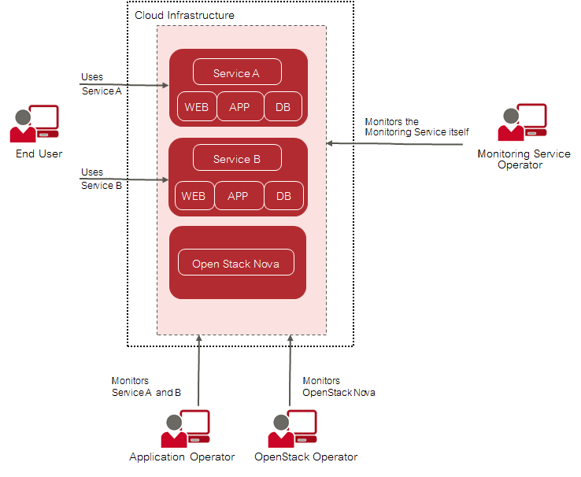
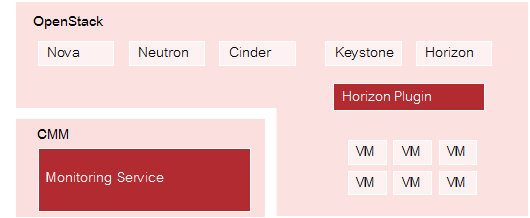

## 1 Introduction

As more and more applications are deployed on cloud systems and cloud systems are growing in
complexity, managing the cloud infrastructure is becoming increasingly difficult. Cloud Monitoring
Manager (CMM) helps mastering this challenge by providing a sophisticated Monitoring as a
Service solution that is operated on top of OpenStack-based cloud computing platforms.
CMM addresses the requirements of large-scale public and private clouds where high numbers
of physical and virtual servers need to be monitored and huge amounts of monitoring data need
to be managed. It consolidates metrics, alarms, and notifications, as well as health and status
information from multiple systems, thus reducing the complexity and allowing for a higher-level
analysis of the monitoring data.

CMM covers all aspects of a Monitoring as a Service solution:

- Storage of monitoring data in a resilient way.
- Multi-tenancy architecture for submitting and streaming metrics. The architecture ensures the
  secure isolation of metrics data.
- Horizontal and vertical scalability to support constantly evolving cloud infrastructures. When
  physical and virtual servers are scaled up or down to varying loads, the monitoring solution can
  be adapted accordingly.

## 1.1 Basic Usage Scenario

The basic usage scenario of setting up and using the monitoring features of CMM looks as
follows:

As an **application operator** , you have booked virtual machines in OpenStack to provide services
to end users or to host services that you need for your own development activities. CMM helps
you ensure that the virtual machines on which these services are provided are working as
required.

The **OpenStack operator** uses CMM to monitor physical and virtual servers, hypervisors, and
services of the underlying platform. In addition, an OpenStack operator is responsible for the 
middleware components, for example the database services. The OpenStack operator also prepares the monitoring
environment including available metrics for application operators.

The **Monitoring Service operator** is responsible for providing the cloud monitoring features to the
application operators and the OpenStack operator. This enables the application operators and the
OpenStack operator to focus on the operation and quality of their services without having to carry
out the tedious tasks implied by setting up and administrating their own monitoring software. The
Monitoring Service operator uses the monitoring features for monitoring the operation of
CMM.

Depending on the distribution of tasks in your environment, the tasks of the Monitoring Service
operator and the OpenStack Operator are jointly performed by one system operator or separately
by different system operators.

## 1.2 The Application Operator's Tasks

The OpenStack operator is responsible for preparing your monitoring environment. He activates
the metrics that you can use for monitoring the virtual machines you have booked.

### Metrics

Metrics are self-describing data structures that are uniquely identified by a name and a set of
dimensions. Each dimension consists of a key/value pair that allows for a flexible and concise
description of the data to be monitored, for example region, availability zone, service tier, or
resource ID.

The standard metrics include:

- Metrics on CPU usage, for example the percentage of time the CPU is idle when no I/O
  requests are in progress, or the percentage of time the CPU is used at system level or user
  level.
- Metrics on disk space, for example the percentage of disk space that is used on a device, or
  the total amount of disk space aggregated across all the disks on a particular node.
- Metrics on the average system load over different periods, for example 1 minute, 5 minutes, or
  15 minutes.
- Metrics on memory usage, for example the number of megabytes of total memory or free
  memory, or the percentage of free swap memory.
- Metrics on the network, for example the number of network bytes received or sent per second,
  or the number of network errors on incoming or outgoing network traffic per second.

### Monitoring Functions

CMM provides a graphical user interface that is seamlessly integrated into your cloud
infrastructure. Based on OpenStack Horizon, it visualizes the health and status of your virtual
machines and enables access to all monitoring functionality and the resulting large-scale
monitoring data.

A convenient dashboard visualizes the health and status of your virtual machines. It allows you
to experiment with many ways of analyzing the performance of your resources in real-time. You
cannot only view but also share and explore visualizations of your monitoring data.
For monitoring your virtual machines, CMM provides functions for alarm and notification
management. Template-based alarm definitions allow for monitoring a dynamically changing set
of resources without the need for reconfiguration. This ensures the efficient monitoring of scalable
cloud services.

Alarm definitions allow you to specify expressions that are evaluated based on the metrics data
that is received. Multiple definitions can be combined to form compound alarms. Compound
alarms allow you to track and process even complex events. Notifications can be configured in
order to inform CMM users when an alarm is triggered.

As an application operator, you:

- Build, explore, and share visualizations of your monitoring data.
- Create, update, and delete alarms.
- Create, update, and delete notifications.

For details on the monitoring functions, refer to _Monitoring Services and Virtual Machines_.

### 1.3 Components

The following illustration provides an overview of the CMM components:

### OpenStack

CMM relies on OpenStack, a technology for building cloud computing platforms for public
and private clouds. OpenStack consists of a series of interrelated projects delivering various
components for a cloud infrastructure solution and allowing for the deployment and management
of Infrastructure as a Service (IaaS) platforms.

### Monitoring Service

The Monitoring Service is the central CMM component. It is responsible for receiving, persisting,
and processing metrics and log data, as well as providing the data to the users.
The Monitoring Service relies on Monasca, an open-source Monitoring as a Service solution. It
uses Monasca for high-speed metrics querying and integrates the streaming alarm engine and the
notification engine of Monasca.

### Horizon Plugin

CMM comes with a plugin for the OpenStack Horizon dashboard. The plugin extends the main
dashboard in OpenStack with a view for monitoring. This enables CMM users to access the
monitoring functions from a central Web-based graphical user interface.
Monitoring data is displayed on a convenient and easy-to-use dashboard which fully integrates
with Grafana, an open-source application for visualizing large-scale measurement data.

### 1.4 User Management

CMM is fully integrated with Keystone, the identity service which serves as the common
authentication and authorization system in OpenStack.

The integration with Keystone requires any CMM user to be registered as an OpenStack user. All
authentication and authorization in CMM is done through Keystone. If a user requests monitoring
data, for example, CMM verifies that the user is a valid user in OpenStack and allowed to access
the requested metrics.

CMM users are created and administrated in OpenStack:

- Each user assumes a role in OpenStack to perform a specific set of operations. The
  OpenStack role specifies a set of rights and privileges.
- Each user is assigned to at least one project in OpenStack. A project is an organizational unit
  that defines a set of resources which can be accessed by the assigned users.
  Application operators in CMM can monitor the set of resources that is defined for the projects
  to which they are assigned.

For details on user management, refer to the _OpenStack documentation_.
