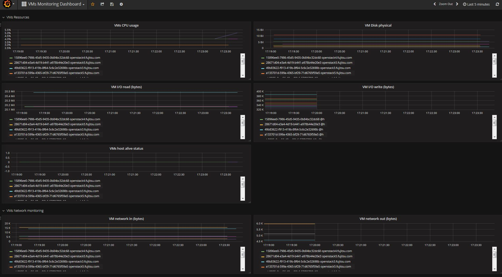
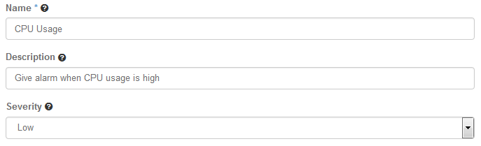
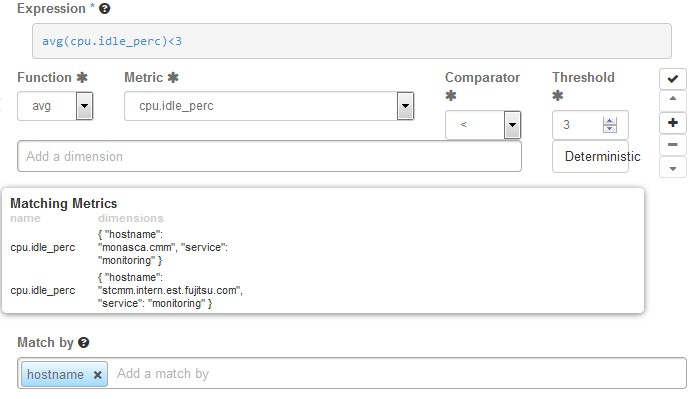
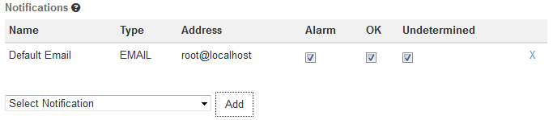

## 3 Monitoring Services and Virtual Machines

CMM offers various features for monitoring your services and the virtual machines on which they
are provisioned. The available metrics in combination with early warnings about problems and
outages assist you in analyzing and troubleshooting any issue you encounter in your environment.
The monitoring features of CMM include:

- A monitoring overview which allows you to access all monitoring information.
- Metrics dashboards for visualizing your monitoring data.
- Alerting features.

In the following sections, you will find information on the monitoring overview and the metrics
dashboards as well as details on how to define and handle alarms and notifications.


## 3.1 Overview

CMM provides one convenient access point to your monitoring data. Use **Monitoring > Overview**
to keep track of your services and virtual machines and quickly check their status.
On the **Overview** page, you can:

- View the status of your resources at a glance. As soon as you have defined an alarm for a
  service or virtual machine and metrics data has been received, relevant status information
  is displayed on the **Overview** page. For details on the status information, refer to _Status of_
  _Services and Virtual Machines_. For details on defining alarms, refer to _Defining Alarms_.
- Access a metrics dashboard. For details, refer to _Viewing Metrics Data_.


## 3.2 Viewing Metrics Data

The user interface for monitoring your services and virtual machines integrates with Grafana, an
open-source application for visualizing large-scale metrics data. CMM ships with a preconfigured
dashboard that visualizes the monitoring data collected from your services and virtual machines.

To access the dashboard, use the **Grafana Home** option located along the top of the **Overview**
page.

Dashboard example:



## 3.3 Defining Alarms

You have to define alarms to monitor your resources. An alarm definition specifies the metrics to
be collected and the threshold at which an alarm is to be triggered for a resource. By default, an
alarm definition is evaluated over a succession of one-minute periods. If the specified threshold is
reached or exceeded within one such period, the alarm is triggered and notifications can be sent
to inform users. The alarm definition is re-evaluated in each subsequent time period.

To create, edit, and delete alarms, **use Monitoring > Alarm Definitions**.

The elements that define an alarm are grouped into **Details** , **Expression** , and **Notifications**.
They are described in the following sections.


### Details



For an alarm definition, you specify the following details:

- **Name**. Mandatory identifier of the alarm. The name must be unique within the project for which
  you define the alarm.
- **Description**. Optional. A short description that outlines the purpose of the alarm.
- **Severity**. The following severities for an alarm are supported: **Low** (default), **Medium** , **High** , or
  **Critical**.
  The severity affects the status information on the **Overview** page. If an alarm that is defined
  as **Critical** is triggered, the corresponding resource is displayed in a red box. If an alarm that
  is defined as **Low** , **Medium** , or **High** is triggered, the corresponding resource is displayed in a
  yellow box.
  The severity level is subjective. Choose a level that is appropriate for prioritizing the alarms in
  your environment.


### Expression



The expression defines how to evaluate the metrics. The expression syntax is based on a simple
expressive grammar. For details, refer to the _Monasca API documentation_.

To handle a large variety of monitoring requirements, you can create either simple alarm
definitions that refer to one metrics only, or compound alarm definitions that combine multiple
metrics in one expression.

Example for a simple alarm definition that checks whether the system-level load of the CPU
exceeds a threshold of 90 percent:

```
cpu.system_perc{hostname=monasca} > 90
```

Example for a simple alarm definition that checks the average time of the system-level load of the
CPU over a period of 480 seconds. The alarm is triggered only if this average is greater than 95
percent:

```
avg(cpu.system_perc{hostname=monasca}, 120) > 95 times 4
```

Example for a compound alarm definition that evaluates two metrics. The alarm is triggered if
either the system-level load of the CPU exceeds a threshold of 90 percent, or if the disk space that
is used by the specified service exceeds a threshold of 90 percent:

```
avg(cpu.system_perc{hostname=monasca}) > 90 OR
max(disk.space_used_perc{service=monitoring}) > 90
```

To define an alarm expression, proceed as follows:

1. Select the metrics to be evaluated.
2. Select a statistical function for the metrics: `min` to monitor the minimum values, `max` to monitor
   the maximum values, `sum` to monitor the sum of the values, `count` for the monitored number,
   `avg` for the arithmetic average, or `last` for the most recent value.
3. Enter one or multiple dimensions in the **Add a dimension** field to further qualify the metrics.
   Dimensions filter the data to be monitored. They narrow down the evaluation to specific
   entities. Each dimension consists of a key/value pair that allows for a flexible and concise
   description of the data to be monitored, for example region, availability zone, service tier, or
   resource ID.
   The dimensions available for the selected metrics are displayed in the **Matching Metrics**
   section. Type the name of the key you want to associate with the metrics in the **Add a
   dimension** field. You are offered a selection for adding the required key/value pair.
4. Enter the threshold value at which an alarm is to be triggered, and combine it with a relational
   operator `<`, `>`, `<=`, or `>=`.
   The unit of the threshold value is related to the metrics for which you define the threshold, for
   example the unit is percentage for `cpu.idle_perc` or MB for `disk.total_used_space_mb`.
5. Switch on the **Deterministic** option if you evaluate a metrics for which data is received only
   sporadically. The option should be switched on, for example, for all log metrics. This ensures
   that the alarm status is `OK` and displayed as a green box on the **Overview** page although
   metrics data has not yet been received.
   Do not switch on the option if you evaluate a metrics for which data is received regularly. This
   ensures that you instantly notice, for example, that a host machine is offline and that there
   is no metrics data for the agent to collect. On the **Overview** page, the alarm status therefore
   changes from OK to UNDETERMINED and is displayed as a white box.
6. Enter one or multiple dimensions in the **Match by** field if you want these dimensions to be
   taken into account for triggering alarms.
   Example: If you enter `hostname` as a dimension, individual alarms will be created for each host
   machine on which metrics data is collected. The expression you have defined is not evaluated
   as a whole but individually for each host machine in your environment.
   If **Match by** is set to a dimension, the number of alarms depends on the number of dimension
   values on which metrics data is received. An empty **Match by** field results in exactly one alarm.
   To enter a dimension, you can simply type the name of the dimension in the **Match by** field.
   The dimensions you enter cannot be changed once the alarm definition is saved.
7. Build a compound alarm definition to combine multiple metrics in one expression. Using the
   logical operators `AND` or `OR`, any number of expressions can be combined.
   Use the **Add** button to append an expression, and choose either AND or OR as the **Operator**
   to connect it to the one you have already defined. Proceed with the second expression as
   described in Step 1 to Step 6 above.
   The following options are provided for creating and organizing compound alarm definitions:
   - Append an additional expression using the **Add** button.
   - Finish editing an appended expression using the **Submit** button.
   - Delete an appended expression using the **Remove** button.
   - Change the position of an appended expression using the **Up** or **Down** button.

> **Note:** You can also edit the expression syntax directly. For this purpose, save your alarm
  definition and update it using the **Edit Alarm Definition option**.
  When updating the alarm definition, you can also change the default time period for each
  alarm definition evaluation. For syntax details, refer to the Monasca API documentation
  on *Alarm Definition Expressions*.


### Notifications



You can enable notifications for an alarm definition. As soon as an alarm is triggered, the enabled
notifications will be sent.

The **Notifications** tab allows you to select the notifications from the ones that are defined in your
environment. For a selected notification, you specify whether you want to send it for a status
transition to **Alarm** , **OK** , and/or **Undetermined**.

For details on defining notifications, refer to _Defining Notifications_. For details on
alarm statuses, refer to _Status of Services and Virtual Machines_.


## 3.4 Defining Notifications

Notifications define how users are informed when a threshold value defined for an alarm is
reached or exceeded. In an alarm definition, you can assign one or multiple notifications.

For a notification, you specify the following elements:

- **Name**. A unique identifier of the notification. The name is offered for selection when defining an
  alarm.
- **Type**. The notification method to be used. `Email`, `Pagerduty`, or `WebHook` can be selected provided
  that the methods were enabled when installing the Monitoring Service.
- **Address**. For `Email`, the email address to be notified when an alarm is triggered.

> **Note:** Generic top-level domains such as business domain names are not supported in email
addresses (for example `user@xyz.company`).

- **Address**. For `WebHook`, the WebHook URL to be loaded when an alarm is triggered.

- **Period**. For `WebHook` only. The integer value indicates how often a notification is to be resent.
To create, edit, and delete notifications, use **Monitoring > Notifications**.


## 3.5 Status of Services and Virtual Machines

The following alarm statuses are distinguished when an alarm definition has been evaluated:

- `Alarm`. The alarm expression has evaluated to true. An alarm has been triggered for the cloud
  resource.
- `OK`. The alarm expression has evaluated to false. There is no need to trigger an alarm.
- `Undetermined`. No metrics data has been received within the defined time period.

As soon as you have defined an alarm for a resource, status information is displayed for it on the
**Overview** page:

The color of the boxes in the three sections indicates the status:

- A green box for a service or virtual machine indicates that it is up and running. There are
  alarms defined for it, but no alarms have been triggered.
- A red box for a service or virtual machine indicates that there is a severe problem that needs to
  be checked. One or multiple alarms defined for it have been triggered.
- A yellow box indicates a problem. One or multiple alarms have already been triggered,
  however, the severity of these alarms is low.
- A white box indicates that though alarms have indeed been defined, metrics data has not yet
  been received.

The status information on the **Overview** page results from one or multiple alarms that have been
defined for the corresponding resource. If multiple alarms are defined, the severity of the individual
alarms controls the status color.

You can click a resource on the **Overview** page to display details on the related alarms. The
details include the status of each alarm and the expression that is evaluated. For each alarm, you
can drill down into the alarm history. To narrow down the problem, the history presents detailed
information on the status transitions.
