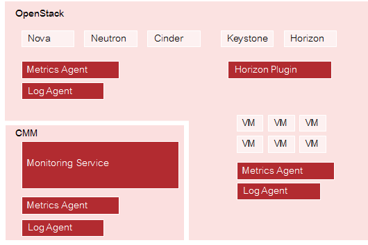

## 1 What is CMM?

As more and more applications are deployed on cloud systems and cloud systems are growing in
complexity, managing the cloud infrastructure is becoming increasingly difficult. Cloud Monitoring
Manager (CMM) helps mastering this challenge by providing a sophisticated Monitoring as a
Service solution that is operated on top of OpenStack-based cloud computing platforms.

CMM allows enterprises to control, track, and optimize their cloud infrastructure and the services
they provide to end users. It offers a suite of monitoring and analytics tools aimed at improving the
health and performance of cloud systems.

CMM assembles and presents metrics and log data in one convenient access point. It offers an
integrated view of cloud resources, based on its seamless integration with OpenStack. While
being flexible and scalable to instantly reflect changes in the cloud infrastructure of an enterprise,
CMM provides the ways and means required to ensure multi-tenancy and data security. The high
availability architecture of CMM ensures an optimal level of operational performance eliminating
the risk of component failures and providing for reliable crossover.

### Enterprise-Grade Monitoring

CMM is an out-of-the-box solution for monitoring OpenStack-based cloud environments. It is made
available to users as a cloud service. As an enterprise-grade solution, CMM provides the reliability,
performance, and service levels required for cloud environments in productive use. It meets a
variety of challenges, ranging from small-scale to high-availability deployments and deployments
with high levels of scalability.

The core of CMM is Monasca, an open-source Monitoring as a Service solution that integrates
with OpenStack. The key features of CMM form an integral part of the Monasca project. CMM
extends the source code base of the project through active contributions.

Compared to the Monasca community edition, CMM provides the following added value:

- Packaging as a commercial enterprise solution
- Enterprise-level support

## 1.1 Key Features

The key features of CMM address public as well as private cloud service providers. They include:

- Monitoring
- Log management
- Integration with OpenStack

### Monitoring

CMM is a highly scalable and fault tolerant monitoring solution for OpenStack-based cloud
infrastructures.

The system operator of the cloud infrastructure and the service providers do not have to care
for system monitoring software any longer. They use CMM to check whether their services and
servers are working appropriately.

CMM provides comprehensive and configurable metrics for monitoring the status, capacity,
throughput, and latency of cloud systems. CMM users can set their own warnings and critical
thresholds and combine multiple warnings and thresholds to support the processing of complex
events. Combined with a notification system, these alerting features enable them to quickly
identify, analyze, and resolve problems in the cloud infrastructure.

For details, refer to Monitoring.

### Log Management

With the increasing complexity of cloud infrastructures, it is becoming more and more difficult and
time-consuming for the system operator to gather, store, and analyze the large amounts of log
data manually. To cope with these problems, CMM provides centralized log management features.

CMM collects log data from all the services and servers the cloud infrastructure is be composed
of. The log data can then be accessed from a single dashboard. Integrated search, filter, and
graphics options enable system operators to isolate problems and narrow down potential root
causes. CMM thus provides valuable insights into the log data, even with large amounts of data
resulting from highly complex environments.

Based on CMM's alerting features and notification system, users can configure warnings and
critical thresholds for log data. If the number of critical log entries reaches a defined threshold, the
users receive a warning and can instantly analyze their logs and start troubleshooting.

For details, refer to Log Management.

### Integration with OpenStack

CMM is integrated with OpenStack core services. These include:

- OpenStack Horizon dashboard for visualizing metrics and log data
- OpenStack user management
- OpenStack security and access control

## 1.2 Components

The following illustration provides an overview of the main components of CMM:

### OpenStack

CMM relies on OpenStack, a technology for building cloud computing platforms for public
and private clouds. OpenStack consists of a series of interrelated projects delivering various
components for a cloud infrastructure solution and allowing for the deployment and management
of Infrastructure as a Service (IaaS) platforms.

For details on OpenStack, refer to the [OpenStack documentation](https://docs.openstack.org/train/).

### Monitoring Service

The Monitoring Service is the central CMM component. It is responsible for receiving, persisting,
and processing metrics and log data, as well as providing the data to the users.

The Monitoring Service relies on Monasca. It uses Monasca for high-speed metrics querying and
log management, and integrates the streaming alarm engine as well as the notification engine of
Monasca.

For details, refer to [Monasca](http://monasca.io/).

### Horizon Plugin

CMM comes with a plugin for the OpenStack Horizon dashboard. The plugin extends the main
dashboard in OpenStack with a view for monitoring and log management. This enables CMM
users to access the CMM functionality from a central Web-based graphical user interface. For
details, refer to the _OpenStack Horizon documentation_.

Based on the Monitoring Service, metrics and log data are visualized on convenient and
user-friendly dashboards which fully integrate with the following applications:

- Grafana (for metrics data). An open-source application for visualizing large-scale measurement
  data.
- Kibana (for log data). An open-source analytics and visualization platform designed to work
  with Elasticsearch.

### Metrics Agent

A Metrics Agent is required for retrieving metrics data from the host on which it runs and sending
the data to the Monitoring Service. The push-based agent supports metrics from a variety of
sources as well as a number of built-in system and service checks.

A Metrics Agent can be installed on each virtual or physical server to be monitored.

The agent functionality is fully integrated into the source code base of the Monasca project. For
details, refer to [Monasca](http://monasca.io/).

### Log Agent

A Log Agent is needed for collecting log data from the host on which it runs and forwarding the
data to the Monitoring Service for further processing. It can be installed on each virtual or physical
server from which log data is to be retrieved.

The agent functionality is fully integrated into the source code base of the Monasca project. For
details, refer to [Monasca](http://monasca.io/).

## 1.3 Users and Roles

CMM users can be grouped by their role. The following user roles are distinguished:

- An **application operator** acts as a service provider in the OpenStack environment. He books
  virtual machines in OpenStack to provide services to end users or to host services that he
  needs for his own development activities. CMM helps application operators to ensure the
  quality of their services in the cloud.
  For details on the tasks of the application operator, refer to the _Application Operator's Guide_.
- The **OpenStack operator** is responsible for administrating and maintaining the underlying
  OpenStack platform and ensures the availability and quality of the OpenStack services (e.g.
  Heat, Nova, Cinder, Swift, Glance, or Keystone).
  For details on the tasks of the OpenStack operator, refer to the _System Operator's Guide_.
- The **Monitoring Service operator** is responsible for administrating and maintaining CMM.
  He provides the cloud monitoring services to the other users and ensures the quality of the
  Monitoring Service.
  For details on the tasks of the Monitoring Service operator, refer to the _System Operator's_
  _Guide_.

Depending on the distribution of tasks in your environment, the tasks of the Monitoring Service
operator and the OpenStack Operator are performed by a single person or shared by different
system operators.

### User Management

CMM is fully integrated with Keystone, the identity service which serves as the common
authentication and authorization system in OpenStack.

The integration with Keystone requires any CMM user to be registered as an OpenStack user. All
authentication and authorization in CMM is done through Keystone. If a user requests monitoring
data, for example, CMM verifies that the user is a valid user in OpenStack and allowed to access
the requested metrics.

CMM users are created and administrated in OpenStack:

- Each user assumes a role in OpenStack to perform a specific set of operations. The
  OpenStack role specifies a set of rights and privileges.
- Each user is assigned to at least one project in OpenStack. A project is an organizational unit
  that defines a set of resources which can be accessed by the assigned users.
  Application operators in CMM can monitor the set of resources that is defined for the projects
  to which they are assigned.

For details on user management, refer to the [OpenStack documentation](https://docs.openstack.org/train/).

## 1.4 Extensions and Add-Ons

Based on Monasca as an open-source core technology, CMM offers the value proposition of
speedy development, high productivity, and maximum transparency. It takes full advantage of
the open-source community while at the same time driving the quality of implementation and the
usability of features.

As a major contributor to Monasca, CMM enhances Monasca's value proposition and comes with
additional expertise that enables product customizations and solutions. To meet specific customer
requirements, specialist know-how is available in the following areas:

- Interfaces with other services. CMM can be used as part of a service bundle, for example in
  combination with OpenStack CloudKitty for rating and pricing.
- Cluster support. CMM can be operated in cluster mode to ensure high availability and fully
  exploit its scalability potential.
- Multi-cloud monitoring. CMM addresses the requirements of multi-cloud platforms. Event
  platforms hosting a mixture of public and private clouds can be monitored.

Contact your FUJITSU support organization for further information.
