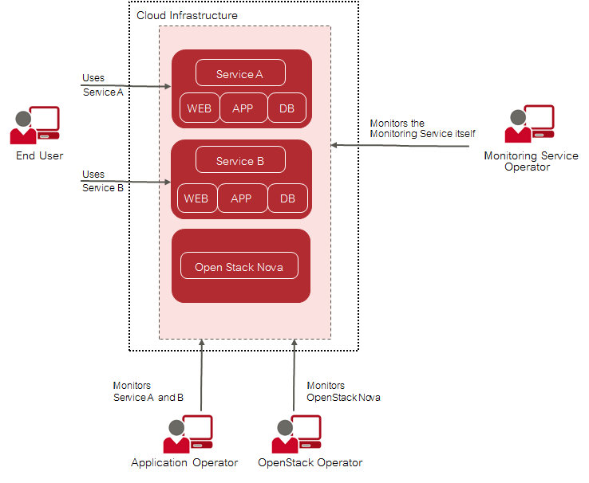

## 2 Monitoring

The monitoring solution of CMM addresses the requirements of large-scale public and private
clouds where high numbers of physical and virtual servers need to be monitored and huge
amounts of monitoring data need to be managed. CMM consolidates metrics, alarms, and
notifications, as well as health and status information from multiple systems, thus reducing the
complexity and allowing for a higher level analysis of the monitored data.

CMM covers all aspects of a Monitoring as a Service solution:

- Storage of monitoring data in a resilient way.
- Multi-tenancy architecture for submitting and streaming metrics. The architecture ensures the
  secure isolation of metrics data.
- Horizontal and vertical scalability to support constantly evolving cloud infrastructures. When
  physical and virtual servers are scaled up or down to varying loads, the monitoring solution can
  be adapted accordingly.

### Basic Usage Scenario

The basic usage scenario of setting up and using the monitoring features of CMM looks as
follows:

The **Monitoring Service operator** is responsible for providing the CMM monitoring features to the
application operators and the OpenStack operator. This enables the application operators and the
OpenStack operator to focus on operation and ensure the quality of their services without having
to carry out the tedious tasks implied by setting up and administrating their own system monitoring
software. The Monitoring Service operator uses the features for monitoring the operation
of CMM.

**Application operators** monitor the virtual machines on which they provide services to **end users**
or services they need for their own development activities. They ensure that the physical and
virtual servers on which their services are provided are up and running as required.

The **OpenStack operator** monitors physical and virtual servers, hypervisors, and services of the
underlying platform. In addition, an OpenStack operator is responsible for the middleware components, 
for example the database services.

### Metrics

A Metrics Agent can be installed and configured on each physical and virtual server where cloud
resources are to be monitored. The agent is responsible for querying metrics and sending the data
to the Monitoring Service for further processing.

Metrics are self-describing data structures that are uniquely identified by a name and a set of
dimensions. Each dimension consists of a key/value pair that allows for a flexible and concise
description of the data to be monitored, for example region, availability zone, service tier, or
resource ID.

The Metrics Agent supports various types of metrics including the following:

- System metrics, for example CPU usage, consumed disk space, or network traffic.
- Host alive checks. The agent can perform active checks on a host to determine whether it is
  alive using ping (ICMP) or SSH.
- Process checks. The agent can check and monitor a process, for example the number of
  instances, memory size, or number of threads.
- HTTP endpoint checks. The agent can perform up/down checks on HTTP endpoints by
  sending an HTTP request and reporting success or failure to the Monitoring Service.
- Service checks. The agent can check middleware services, for example MySQL, Kafka, or
  RabbitMQ.
- OpenStack services. The agent can perform specific checks on each process that is part of an
  OpenStack service.
- Log metrics. The agent can check and monitor the number of critical log entries in the log data
  retrieved from the cloud resources.

### Data Visualization and Analysis

All CMM user groups work with a graphical user interface that is seamlessly integrated into their
cloud infrastructure. Based on OpenStack Horizon, the user interface enables access to all
monitoring functionality and the resulting large-scale monitoring data.

Convenient dashboards visualize the health and status of the cloud resources, for example:

The dashboards allow CMM users to experiment with many ways of analyzing the performance of
their cloud resources in real-time. They cannot only view but also share and explore visualizations
of their monitoring data.

### Alarms and Notifications

CMM supports GUI-based alarm and notification management. Template-based alarm definitions
allow for monitoring a dynamically changing set of resources without the need for reconfiguration.
While the number of underlying virtual machines is changing, this ensures the efficient monitoring
of scalable cloud services. Alarm definitions allow CMM users to specify expressions that are
evaluated based on the metrics data that is received. Alarm definitions can be combined to form
compound alarms. Compound alarms allow users to track and process even more complex
events. Notifications can be configured in order to inform CMM users when an alarm is triggered.
