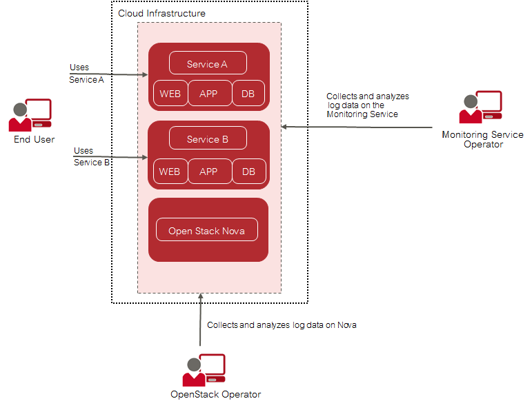
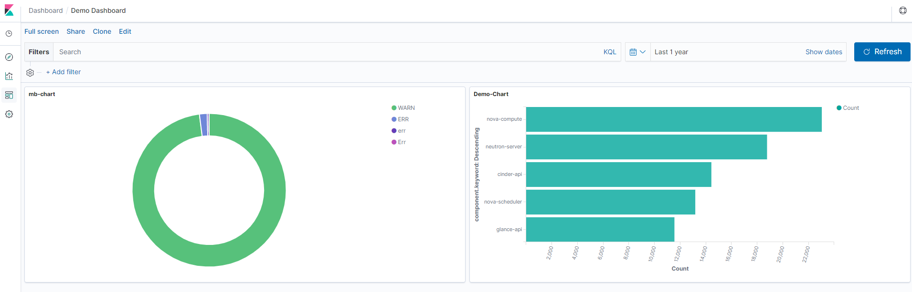

## 3 Log Management

Services and servers in a cloud infrastructure generate huge amounts of log data, ranging from
simple announcements that everything is healthy to detailed information on events or processes.
The logs are distributed over many physical and virtual servers. CMM collects, stores, and queries
these logs and makes them accessible to CMM users in one central place.

CMM covers all aspects of an enterprise-class log management solution:

- Central management of log data from medium and large-size OpenStack deployments.
- Buffered exchange of log data to provide high data throughput.
- Logical isolation of log data through multi-tenancy.
- Scalable architecture capable of mastering the data load from a large number of nodes in
  OpenStack environments. The log management solution can be horizontally and vertically
  adapted to constantly changing data loads.

### Basic Usage Scenario

The basic usage scenario of setting up and using the log management features of CMM looks as
follows:

The **Monitoring Service operator** is responsible for providing the CMM log management features
to the OpenStack operator. A Monitoring Service operator uses the features for retrieving log data on CMM.

The **OpenStack operator** uses the log management features for retrieving log data on the
OpenStack services and the middleware components that make up the underlying OpenStack
platform.

### Data Collection

A Log Agent can be installed and configured on each physical and virtual server where log data is
to be retrieved. The agent is responsible for collecting the log data from the cloud resources and
sending it to the Monitoring Service for further processing.

CMM stores the log data in a central database. The central database forms the basis for
visualizing the log data for the CMM users.

### Data Visualization and Analysis

CMM supports advanced data visualization and analysis of the log data in a variety of charts,
tables, or maps. Visualizations can easily be combined in dynamic dashboards that display query
results in real-time, for example:

Based on OpenStack Horizon, the customizable dashboards are seamlessly integrated into the
cloud infrastructure. They enable user access to all log management functionality.

### Alarms and Notifications

GUI-based alarm and notification management is supported for the log data. Based on a template
mechanism, CMM allows system operators to configure alarms and notifications for monitoring the
number of critical log events over time. When the number of critical log entries exceeds a defined
threshold, a corresponding notification is sent. For details on alarm definitions and notifications, 
refer to the _Application Operator's Guide_.

The template mechanism is not limited to a single cloud resource but can be used to analyze
a scalable set of resources. 

The automation of log handling guarantees that system operators identify problems in their
infrastructure early and find the root cause of these problems quickly.
