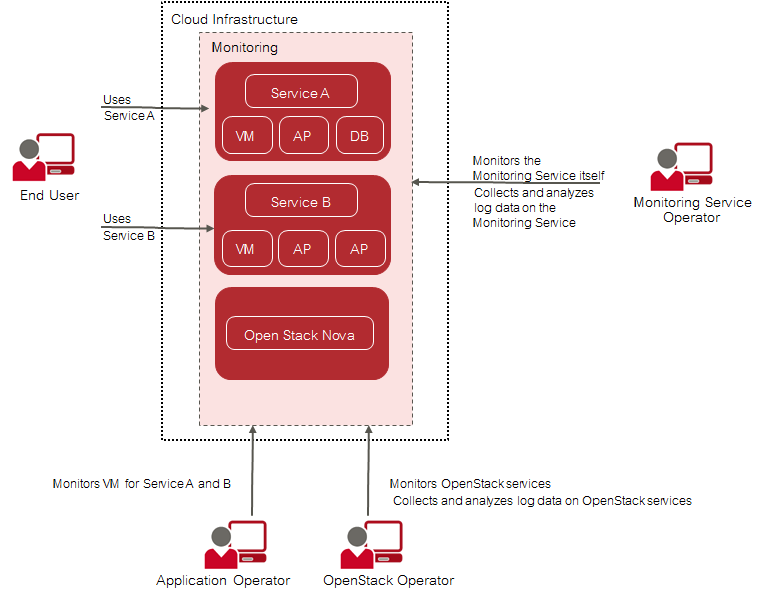
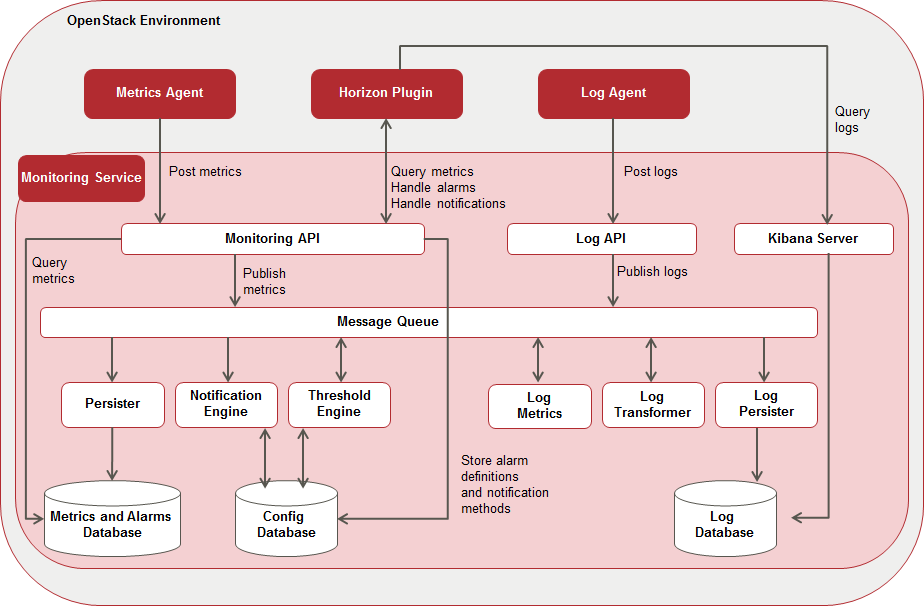

## 1 Introduction to CMM

As more and more applications are deployed on cloud systems and cloud systems are growing in
complexity, managing the cloud infrastructure is becoming increasingly difficult. Cloud Monitoring
Manager (CMM) helps mastering this challenge by providing a sophisticated Monitoring as a
Service solution that is operated on top of OpenStack-based cloud computing platforms.

The component architecture of OpenStack provides for high flexibility, yet it increases the burden
of system operation because multiple services must be handled. CMM offers an integrated view
of all services and assembles and presents related metrics and log data in one convenient access
point. While being flexible and scalable to instantly reflect changes in the OpenStack platform,
CMM provides the ways and means required to ensure multi-tenancy, high availability, and data
security.

CMM covers all aspects of a Monitoring as a Service solution:

- Central management of monitoring and log data from medium and large-size OpenStack
    deployments.
- Storage of metrics and log data in a resilient way.
- Multi-tenancy architecture to ensure the secure isolation of metrics and log data.
- Horizontal and vertical scalability to support constantly evolving cloud infrastructures. When
    physical and virtual servers are scaled up or down to varying loads, the monitoring and log
    management solution can be adapted accordingly.

## 1.1 Basic Usage Scenario

The basic usage scenario of setting up and using the monitoring features of CMM looks as
follows:

An **application operator** acts as a service provider in the OpenStack environment. This person books
virtual machines to provide services to **end users** or to host services that are needed for his or her own
development activities. CMM helps application operators ensure that their services and the
servers on which they are provided are configured and working as required.

The **OpenStack operator** is responsible for administrating and maintaining the underlying
OpenStack platform. The monitoring and log management services of CMM enable him or her to ensure
the availability and quality of the platform. This person uses CMM for:

- Monitoring physical and virtual servers, hypervisors, and OpenStack services.
- Monitoring middleware components, for example, database services.
- Retrieving and analyzing the log data of the OpenStack services and servers, the middleware
    components, and the operating system.

The **Monitoring Service operator** is responsible for providing the monitoring and log
management features to the application operators and the OpenStack operator. This enables
them to focus on operation and the quality of their services and servers without having to carry
out the tedious tasks implied by setting up and administrating their own monitoring software. The
Monitoring Service operator uses the monitoring features for ensuring the quality of CMM.

### Tasks Overview

Depending on the distribution of tasks in your environment, the tasks of the Monitoring Service
operator and the OpenStack Operator are performed by a single person or shared by different
system operators.

When taking on the role of the Monitoring Service operator, you have the following responsibilities:

- Installation and setup of the Monitoring Service, thus providing the monitoring and log
    management features to the other CMM user groups.
- Regular maintenance of the components and services CMM consists of.
- Backup of the CMM databases, configuration files, and customized dashboards.
- Monitoring of CMM.

When taking on the role of the OpenStack operator, you have the following responsibilities:

- Installation and configuration of the OpenStack extention points required for CMM.
- Preparing the monitoring environment for the application operators.
- Monitoring the OpenStack services and servers.

## 1.2 Architecture and Components

The following illustration provides an overview of the main components of CMM and their
interaction:

### OpenStack

CMM relies on OpenStack, a technology for building cloud computing platforms for public
and private clouds. OpenStack consists of a series of interrelated projects delivering various
components for a cloud infrastructure solution and allowing for the deployment and management
of Infrastructure as a Service (IaaS) platforms.

For details on OpenStack, refer to the _OpenStack documentation_.

### Monitoring Service

The Monitoring Service is the central CMM component. It is responsible for receiving, persisting,
and processing metrics and log data, as well as providing the data to the users.

The Monitoring Service relies on Monasca. It uses Monasca for high-speed metrics querying and
log management, and integrates the streaming alarm engine as well as the notification engine of
Monasca.

The Monitoring Service consists of the following components:

- **Monitoring API**
  A RESTful API for monitoring. It is primarily focused on the following areas:
  - Metrics: Store and query massive amounts of metrics in real- time.
  - Statistics: Provide statistics for metrics.
  - Alarm Definitions: Create, update, query, and delete alarm definitions.
  - Alarms: Query and delete the alarm history.
  - Notification Methods: Create and delete notification methods and associate them with
    alarms. Users can be notified directly when alarms are triggered, for example via email.
- **Message Queue**
  A component that primarily receives published metrics from the Monitoring API, alarm state
  transition messages from the Threshold Engine, and log data from the Log API. The data
  is consumed by other components, such as the Persister, the Notification Engine, and the
  Log Persister. The Message Queue is also used to publish and consume other events in the
  system. It is based on Kafka, a high-performance, distributed, fault-tolerant, and scalable
  message queue with durability built-in. For administrating the Message Queue, CMM uses
  Zookeeper, a centralized service for maintaining configuration information, naming, providing
  distributed synchronization, and providing group services.
- **Persister**
  A Monasca component that consumes metrics and alarm state transitions from the Message
  Queue and stores them in the Metrics and Alarms Database (InfluxDB).
- **Notification Engine**
  A Monasca component that consumes alarm state transition messages from the Message
  Queue and sends notifications for alarms, such as emails.
- **Threshold Engine**
  A Monasca component that computes thresholds on metrics and publishes alarms to the
  Message Queue when they are triggered. The Threshold Engine is based on Apache Storm, a
  free and open distributed real-time computation system.
- **Metrics and Alarms Database**
  An InfluxDB database used for storing metrics and the alarm history.
- **Config Database**
  A MySQL database used for storing configuration information, alarm definitions, and
  notification methods.
- **Log API**
  A RESTful API for log management. It gathers log data from the Log Agents and forwards it to
  the Message Queue.
  The CMM log management is based on Logstash, a tool for receiving, processing, and
  publishing all kinds of logs. It provides a powerful pipeline for querying and analyzing logs.
  Elasticsearch is used as the back-end datastore, and Kibana as the front-end tool for retrieving
  and visualizing the log data.
- **Log Transformer**
  A Logstash component that consumes the log data from the Message Queue, performs
  transformation and aggregation operations on the data, and publishes the data that it creates
  back to the Message Queue.
- **Log Metrics**
  A Monasca component that consumes log data from the Message Queue, filters the data
  according to severity, and generates metrics for specific severities, for example for errors or
  warnings. The generated metrics are published to the Message Queue and can be further
  processed by the Threshold Engine like any other metrics.
- **Log Persister**
  A Logstash component that consumes the transformed and aggregated log data from the
  Message Queue and stores it in the Log Database.
- **Kibana Server**
  A Web browser-based analytics and search interface to the Log Database.
- **Log Database**
  An Elasticsearch database for storing the log data.

> **Note:** The installation of the Monitoring Service includes the installation of all CMM
  third-party components that are required. From time to time, it may be necessary to install bug
  fixes or security patches for these third-party components. In order to guarantee for the
  interoperability and integrity of your CMM installation, you should obtain such fixes and
  patches solely from your CMM support organization.

### Horizon Plugin

CMM comes with a plugin for the OpenStack Horizon dashboard. The plugin extends the main
dashboard in OpenStack with a view for monitoring and log management. This enables CMM
users to access the CMM functionality from a central Web-based graphical user interface. For
details, refer to the _OpenStack Horizon documentation_.

Based on the Monitoring Service, metrics and log data are visualized on convenient and
user-friendly dashboards which fully integrate with the following applications:

- Grafana (for metrics data). An open-source application for visualizing large-scale measurement
    data.
- Kibana (for log data). An open-source analytics and visualization platform designed to work
    with Elasticsearch.

### Metrics Agent

A Metrics Agent is required for retrieving metrics data from the host on which it runs and sending
the data to the Monitoring Service. The push-based agent supports metrics from a variety of
sources as well as a number of built-in system and service checks.

A Metrics Agent can be installed on each virtual or physical server to be monitored.
The agent functionality is fully integrated into the source code base of the Monasca project. For
details, refer to Monasca.

### Log Agent

A Log Agent is needed for collecting log data from the host on which it runs and forwarding the
data to the Monitoring Service for further processing. It can be installed on each virtual or physical
server from which log data is to be retrieved.

The agent functionality is fully integrated into the source code base of the Monasca project. For
details, refer to Monasca.

## 1.3 User Management

CMM is fully integrated with Keystone, the identity service which serves as the common
authentication and authorization system in OpenStack.

The integration with Keystone requires any CMM user to be registered as an OpenStack user. All
authentication and authorization in CMM is done through Keystone. If a user requests monitoring
data, for example, CMM verifies that the user is a valid user in OpenStack and allowed to access
the requested metrics.

CMM users are created and administrated in OpenStack:

- Each user assumes a role in OpenStack to perform a specific set of operations. The
    OpenStack role specifies a set of rights and privileges.
- Each user is assigned to at least one project in OpenStack. A project is an organizational unit
    that defines a set of resources which can be accessed by the assigned users.
    Application operators in CMM can monitor the set of resources that is defined for the projects
    to which they are assigned.

For details on user management, refer to the _OpenStack documentation_.

## 1.4 Distribution Media

CMM is distributed in the CMM installation package. It contains archive files with the CMM
software and documentation for installing and configuring CMM.

The `CMM_server_2.0.14-x.tar.gz` file includes (replace x with the current version number of CMM):

- `CMM_server_2.0.14-x.images.tar` Tarred archive file with the Docker images required for
    installing and configuring CMM.
- `docker-compose-Linux-x86_64_1.27.4` Docker Compose binary required to install CMM.
- `containerd.io-1.4.4-3.1.el7.x86_64.rpm` Docker-CE dependency rpm.
- `docker-ce-19.03.15-3.el7.x86_64.rpm` Docker-CE rpm.
- `docker-ce-cli-19.03.15-3.el7.x86_64.rpm` Docker-CLI rpm.
- `docker-compose-metric.yml` and `docker-compose-log.yml` Docker Compose YAML files
    required for installing and configuring CMM.
- `.env` Docker Compose environment file defining the default environment variables used by
    Docker Compose.

The `CMM_client_2.0.14-x.tar.gz` file includes (replace x with the current version number of CMM):

- `monasca-agent-CMM_2.0.14-x.run` Executable for installing a Metrics Agent on an OpenStack
    node.
- `log-agent-CMM_2.0.14-x.run` Executable for installing a Log Agent on an OpenStack node.
- `monasca-ui-CMM_2.0.14-x.run` Executable for installing the Horizon Plugin on the node where
    the OpenStack Horizon Service is deployed.

The `CMM_documentation_2.0.14-x.tar.gz` file includes Markdown manuals providing an overview of
CMM as well as information directed to system operators and application operators (replace `x` with
the current version number of CMM).
