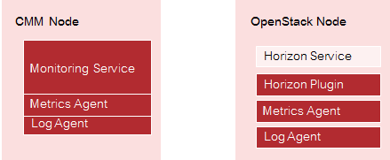

## 2 Installation

The installation of CMM comprises the following steps:

1. Preparing the installation environment.
2. Preparing the integration of CMM with your OpenStack platform.
3. Installing the Monitoring Service.
   The installation of the Monitoring Service is based on Docker. Production-ready Docker images
   are provided for the services that make up the Monitoring Service. Instances of these images
   run in separate Docker containers as soon as the installation is successful.
4. Installing a Metrics Agent.
   A Metrics Agent is installed as an extension to your OpenStack platform for monitoring an
   OpenStack service and the server on which it is deployed.
5. Installing a Log Agent.
   A Log Agent is installed as an extension to your OpenStack platform for managing the logs of
   an OpenStack service and the server on which it is deployed.
6. Installing the Horizon Plugin.
   The Horizon Plugin is installed as an extension to your OpenStack platform. It is required for
   accessing the monitoring and log management functions of CMM from OpenStack Horizon.

The following picture depicts a simplified installation scenario with a CMM node and one
OpenStack node only:



Observe the following when installing CMM:

- It is recommended that you use a dedicated physical machine as a CMM node which meets
  the requirements outlined in the next section. It is not recommended that there are any other
  services running on the machine.

> **Note:** The Monitoring Service can be installed on a virtual machine. For CMM in productive
  operation, however, keep in mind that CMM has demanding hardware requirements that
  are not met by a virtual machine. In addition, neighboring virtual machines may cause
  trouble.

- The installation of the Monitoring Service automatically includes the installation of a Metrics
  Agent and a Log Agent for monitoring CMM.
- The Horizon Plugin must be installed on the node where the OpenStack Horizon Service is
  deployed.
- A productive OpenStack environment consists of multiple OpenStack nodes on which multiple
  services are running. You can install the agents on any OpenStack node where a service to be
  monitored is deployed.


## 2.1 Prerequisites and Preparation

The following sections describe the prerequisites that must be fulfilled and the preparations you
need to take before installing CMM.

## 2.1.1 Hardware and Operating Systems

CMM can be installed on a host machine with the following operating systems:

- Red Hat Enterprise Linux 7.7 for Intel64.

> **Note:** Make sure that you use a clean operating system. This avoids compatibility-related
  issues during the installation.

As underlying platform technology, the following OpenStack platforms are supported:

- Red Hat Enterprise Linux OpenStack Platform 16.1 installed on Red Hat Enterprise Linux 8.2

The following hardware resources are recommended:

| Requirement | Description |
|--|--|
| Architecture | x86_64 |
| RAM | At least 32 GB, 64 GB or more recommended. |
| CPU | At least 8 cores, 16 cores or more recommended. |
| Hard disk | HDD or SSD, SSD strongly recommended for productive operation and high performance.|
| Disk space | See below. |

CMM without any data requires about 2 GB of disk space. The disk capacity required for log data
and metrics data varies considerably depending on the number of services and servers to be
monitored. For information on how to calculate the required disk space, refer to the section below.

The installation mounts a volume for the data directories of Elasticsearch, InfluxDB, MySQL,
Kafka, and Grafana. The default installation uses the `/opt/monasca-containers/` directory.


### Calculating the Required Disk Space

As a basic rule of thumb, the following formula can be used for calculating the required disk space:

```
200 GB + [ <number of nodes> * <retention period> * (<space for log data/day> + <space for metrics data/day>) ]
```

Replace the variables as follows:

- The number of nodes corresponds to the number of nodes to be monitored.
- The retention period corresponds to 60 days for InfluxDB and Elasticsearch.
- The space for log data/day corresponds to approximately 2 GB.
- The space for metrics data/day corresponds to approximately 50 MB.

The formula is based on the following assumptions for log data:

- Approximately 50 log files per node
- Approximately 1 log entry/file/sec
- 200 bytes in size

The formula is based on the following assumptions for metrics data:

- 400 metrics per node
- Time interval of 30 secs
- 20 bytes in size

> **Note:** Depending on the OpenStack nodes to be monitored there might be additional factors
  that have an impact on the required disk space, for example enabling debug logging for
  the OpenStack services.


## 2.1.2 Web Browsers

CMM has been tested with the following Web browsers:

- Google Chrome 90.
- Mozilla Firefox 58.


## 2.1.3 Security

In a default Red Hat Enterprise Linux installation, the following security precautions are taken:

- A firewall exists to prevent unauthorized user access.
- Security-Enhanced Linux (SELinux), a security module that adds mandatory access control
  mechanisms to the Linux kernel, is enabled.
    
Before installing CMM, make sure that the firewall and SELinux match your security requirements.

Access to the following ports must be enabled, before installing CMM:

- Port `5607` for the Log API.
- Port `8070` for the Monitoring API.
- Port `5601` for the Kibana Server.
- Port `3000` for Grafana.

In addition, access to port 8081 is required internally by the Monitoring API, for example for
healthchecks or threads.

To integrate with the required OpenStack services, CMM requires access to the following ports:

- Port `80` for the OpenStack Horizon service.
- Port `5000` and `35357` for the OpenStack Keystone service.


## 2.2 Preparing the OpenStack Integration

All authentication and authorization in CMM is done through OpenStack Keystone. The integration
of CMM with OpenStack must therefore be prepared before you install the Monitoring Service on
the CMM node and the OpenStack extensions on an OpenStack node.

You need to take the following preparations on an OpenStack node:

- Setting the OpenStack administator credentials.
- Creating a project, a user, and the required roles.
- Defining services and endpoints.
- Configuring the HTTP proxy.


## 2.2.1 Setting the Administrator Credentials

To perform any action in OpenStack Keystone, it is required to provide the administrator
credentials.

Example:

```
export OS_USERNAME=admin
export OS_PROJECT_NAME=admin
export OS_PASSWORD=<admin_password>
export OS_AUTH_URL=<http://<os_auth_ip>:5000
export OS_REGION_NAME=<region>
export OS_PROJECT_DOMAIN_NAME=Default
export OS_USER_DOMAIN_NAME=Default
```

Please replace:
*  `<admin_password>` by password of OpenStack admin user
*  `<os_auth_ip>` by IP of the server where OpenStack keystone service is running
*  `<region>` by the name of your OpenStack region, e.g. `regionOne`.  
  
You can verify the provided credentials with the following command:

```
openstack service list
```


## 2.2.2 Creating Projects, Users, and Roles

To integrate CMM with the OpenStack Keystone service, specific preparations must manually be
taken in OpenStack Keystone.

You have to create a project, a user, and the required roles. The project, the user and the roles
must exist before you proceed with installing the Monitoring Service.


### Creating a Project

A dedicated OpenStack project must be prepared for CMM. The monitoring data retrieved for
CMM and your OpenStack services and servers is accessible to users assigned to this project,
provided they have the required role assigned.

Example:

```
openstack project create monasca
```

### Creating Roles

The following OpenStack roles must be prepared:

- `monasca-user`. This role must be assigned to any user who wants to perform monitoring and
  log management tasks.
- `monasca-agent`. This role must be assigned to the user used for authenticating the Metrics
  Agent and the Log Agent against OpenStack Keystone.

Example:

```
openstack role create monasca-user
openstack role create monasca-agent
```

### Creating a User

An OpenStack user must be prepared that is used for authenticating an agent against
OpenStackKeystone. The user must be specified in the agent configuration. The user must have
the `monasca-agent` role in OpenStack and be assigned to the OpenStack project that is to be
monitored by the agent.

This user is used by the Metrics Agent and the Log Agent to submit data to the Monitoring
Service. It is recommended that this user is used only for configuration purposes and not for
actually monitoring services and servers.

Example:

```
openstack user create --project monasca --password password monasca-agent
```

### Assigning Roles

The following assigments must be prepared:

- The new OpenStack user (`monasca-agent` in the example) must be assigned to the project
  prepared for CMM and must have the `monasca-agent` role in this project.
- The OpenStack `admin` user must be assigned to the project prepared for CMM and must have
  the `monasca-user` and `admin` roles in this project.

Example:

```
openstack role add --project monasca --user monasca-agent monasca-agent
openstack role add --project monasca --user admin monasca-user
openstack role add --project monasca --user admin admin
```

## 2.2.3 Defining Services and Endpoints

The Horizon Plugin requires a set of services and endpoints that must be defined in OpenStack
Keystone.

For this purpose, check your OpenStack Keystone setup, and create the required services and
endpoints. You can create them as follows:

```
openstack service create --name monasca monitoring
openstack service create --name logs logs

openstack endpoint create monasca public http://<cmm_ip>:8070/v2.0 --region <region>
openstack endpoint create logs public http://<cmm_ip>:5607/v2.0 --region <region>
```

Replace `<cmm_ip>` by the IP address of the CMM node for example,
`http://192.168.10.6:8070/v2.0`, and `<region>` by the name of your OpenStack region, for
example, `regionOne`.


## 2.3 Installing the Monitoring Service

Before installing the Monitoring Service make sure that you have made the preparations required
for your OpenStack platform.

## 2.3.1 Prerequisites

For installing the Monitoring Service, a server with RHEL7.7 is required with:

- Docker-CE 19.03.15 For details, refer to the _Docker documentation_. RPMs are included in the
  `CMM_server_2.0.14-x.tar.gz` file.
- Docker Compose binary as included in the `CMM_server_2.0.14-x.tar.gz` file. 

Installation of docker and docker-compose is described in the following chapter.  

Depending on the Elasticsearch requirements resulting from your production environment, it
is recommended that you customize the default Elasticsearch configuration provided by the
Monitoring Service installation. For details on preparations related to Elasticsearch in productive
use, refer to the _Monasca Docker documentation_.


## 2.3.2 Installation

To install the Monitoring Service, proceed as follows:

1. Log in to the machine on which to install the Monitoring Service (CMM node) as a user with
   root privileges.
2. Prepare an installation directory.
3. Extract the `CMM_server_2.0.14-x.tar.gz` archive file from the CMM installation package to the
   installation directory. The archive provides the following files:
    - `CMM_server_2.0.14-x.images.tar`
    - `containerd.io-1.4.4-3.1.el7.x86_64.rpm`
    - `docker-ce-19.03.15-3.el7.x86_64.rpm`
    - `docker-ce-cli-19.03.15-3.el7.x86_64.rpm`
    - `docker-compose-Linux-x86_64_1.27.4`
    - `docker-compose-metric.yml`
    - `docker-compose-log.yml`
    - `.env`
4. go to the installation directory:  `cd <install_dir>`
5. Install Docker-CE 19.03.15
> **Note:** Docker-CE requires the package `container-selinux` which is available in the repository
   `rhel-7-server-extras-rpms` please enable it.
```
# yum install docker-ce-19.03.15-3.el7.x86_64.rpm docker-ce-cli-19.03.15-3.el7.x86_64.rpm containerd.io-1.4.4-3.1.el7.x86_64.rpm
```
  
> **Note:** It is recommended to configure data retention for Docker container logs. Refer to Log File
  Handling for details.  
  
6. Copy the `docker-compose-Linux-x86_64_1.27.4` file to the `/usr/local/bin/` directory and
   rename it to `docker-compose`.
7. Open the `.env` file in the installation directory to make the adaptions required for your
   environment.

> **Note:** Restrict the access permissions of the `.env` file. It specifies passwords that must
  be protected from unauthorized access!

8. For integrating the Monitoring Service with OpenStack Keystone, you have to specify the
   following parameters:

```
# Set the IPv4 address of the OpenStack Keystone host
MON_KEYSTONE_URL=http://<ipv4_address>:5000

# Specify the URL of the OpenStack Horizon host
# The URL is needed for setting the Monasca data source in Grafana
HORIZON_URL=http://<ip_address:port>
HORIZON_PATH=/dashboard

# Enable Kibana authorization via OpenStack Horizon
MON_MONASCA_PLUGIN_ENABLED=True

# Set the path to mount Kibana to the OpenStack Horizon proxy
MON_BASE_PATH=/dashboard/monitoring/logs_proxy

# Define Grafana administrator settings
MON_GRAFANA_ADMIN_USER=<grafana_admin_user_name>
MON_GRAFANA_ADMIN_PASSWORD=<grafana_admin_password>
```

- Replace `<ipv4_address>` by the IP address of the node on which the OpenStack Keystone
  service is deployed. Example URL: `http://172.31.0.216:5000`.
- Replace `<ip_address:port>` by the IP address and port of the node on which the
  OpenStack Horizon service is deployed. This is required for configuring the Monasca data
  source in Grafana. Example URL: `http://172.31.0.216:80`.
- Set the `MON_MONASCA_PLUGIN_ENABLED` parameter to `True`.
- Set the `MON_BASE_PATH` parameter to `/dashboard/monitoring/logs_proxy`.
- Replace `<grafana_admin_user_name>` and `<grafana_admin_password>` by the
  credentials of a Grafana administrator. This user is automatically created with the
  installation of the Monitoring Service, and is assigned the `admin` flag in Grafana.


> **Note:** CMM ships with preconfigured metrics dashboards. The Grafana administrator created
  with `MON_GRAFANA_ADMIN_USER` is authorized to create additional dashboards for the
  CMM users, or to update and delete the preconfigured ones, if required.

9. For enabling access to OpenStack Keystone, you have to specify credentials for the Metrics
   Agent and Log Agent, as well as for the Monitoring API and the Log API in the "Set the
   OpenStack Keystone credentials" section:

```
# Credentials of the user used for authenticating the agents
# against Keystone
MON_AGENT_USERNAME=<user_name>
MON_AGENT_PASSWORD=<password>
MON_AGENT_PROJECT_NAME=<project_name>

# Credentials of the OpenStack admin
MON_KEYSTONE_ADMIN_USER=<OpenStack_admin_user_name>
MON_KEYSTONE_ADMIN_PASSWORD=<OpenStack_admin_password>
```

- Replace `<user_name>` and `<password>` by the credentials of the user used for
  authenticating the agents against OpenStack Keystone, and replace `<project_name>` by
  the name of the OpenStack project for which data is to be retrieved by the agents.
  The names and passwords that you enter must correspond to the project and agent user
  you have already prepared for the integration of CMM with OpenStack. For details, refer to
  _Creating Projects, Users, and Roles_.

Example:

```
MON_AGENT_USERNAME=monasca-agent
MON_AGENT_PASSWORD=password
MON_AGENT_PROJECT_NAME=monasca
```

- Replace `<OpenStack_admin_user_name>` and `<OpenStack_admin_password>` by
  the credentials of the OpenStack admin user. By default, the admin user is used for
  authenticating the Monitoring API and the Log API against OpenStack Keystone.

10. The installation of the Monitoring Service mounts `/opt/monasca-containers/` as default
   volume for the data directories of Elasticsearch, InfluxDB, MySQL, Kafka, and Grafana.
   
If required, you can update the `MON_DOCKER_VOL_ROOT` parameter, and specify a different
volume.

```
# Set the path for the data directories of Elasticsearch,
# InfluxDB, MySQL, Kafka, and Grafana
MON_DOCKER_VOL_ROOT=<path_to_data_directories>
```

11. The installation of the Monitoring Service mounts `/mount/backup/` as default volume for
   backing up the databases.

If required, you can update the `MON_BACKUP_DIR` parameter, and specify a different volume.

```
# Set the path for the backup directories of Elasticsearch,
# InfluxDb, and MySQL
MON_BACKUP_DIR=<path_to_backup_directories>
```

12. By default, CMM retains the data stored in the Elasticsearch and InfluxDB database for 31
    days. Older data is automatically deleted.

If required, you can change the data retention parameters in the Configure data retention
section.

```
# Retention period for Elasticsearch database
# Delete job is executed every day at 12 a.m. UTC
MON_ELASTICSEARCH_DATA_RETENTION_DAYS=<number_of_days>

# Retention period for InfluxDB database
MON_INFLUXDB_RETENTION=<number_of_days>d
```

Replace `<number_of_days>` by the number of days after which data is to be deleted.

Example:

```
MON_ELASTICSEARCH_DATA_RETENTION_DAYS=30
MON_INFLUXDB_RETENTION=30d
```

13. Enable the notification methods to be used to inform CMM users when a threshold value for an
    alarm is reached or exceeded.
    Email, Slack, and Webhook are methods supported by CMM. If you want to use HipChat,
    PagerDuty, or Jira, or need an extension to the Notification Engine for exchanging  information
    with additional external systems, contact your FUJITSU support organization.
    The notification methods to be enabled must be specified as comma-separated values for
    the NF_PLUGINS parameter in the Enable the Notification Engine plugins section. Use
    lower-case characters only.
    Example for enabling Email and WebHook:

```
NF_PLUGINS=webhook,email
```

The `webhook` plugin is enabled by default. For the other plugins, you have to additionally define
the corresponding configuration parameters in the `.env` file. For details on the parameters,
refer to the information in the file.

14. Load the tarred repository from the `CMM_server_2.0.14-x.images.tar` file. This restores both the
    images and the tags from the archive to your installation directory.

```
docker load -i CMM_server_2.0.14-x.images.tar
```

15. Check that the images and tags required for the installation have been loaded.

```
docker images
```

16. Run docker-compose up.

```
docker-compose -f docker-compose-metric.yml -f docker-compose-log.yml up -d
```

> **Note:** Make sure that the OpenStack Keystone service is up when running docker-compose
  up. Use -d to start the containers in the background and leave them running when the
  command exits. Refer to the _Docker Compose documentation_ for additional details on
  the docker-compose up command.

After a successful deployment, the monitoring pipeline starts within approximately one minute.

17. To restrict access to the backup and data directories, you must change the access
    permissions. Example:

```
chmod -R 700 /opt/monasca-containers
chmod -R 700 /mount/backup/
```

### CMM Services

By default, Docker Compose starts containers for the following services. They correspond to the
main components of CMM:

| Service Name    | Description |
|-----------------|-------------|
| agent-collector | Collector service of the Metrics Agent. Based on a configurable interval, the collector component collects the metrics data from the monitored services and servers. |
| agent-forwarder | Forwarder service of the Metrics Agent. The forwarder component takes the data from the collector and sends them to the Monitoring API. |
| elasticsearch | Elasticsearch database service. CMM stores the log data in this database. |
| grafana | Grafana service. CMM uses it to enable the integration with the OpenStack Keystone service and to include Monasca as Grafana data source. |
| influxdb | InfluxDB database service. CMM stores metrics and alarms in this database. |
| kafka | Message queue service. |
| kibana | Kibana server. |
| log-agent | Log Agent. |
| log-api | Log API. |
| log-metrics | Log Metrics. |
| log-persister | Log Persister. |
| log-transformer | Log Transformer. |
| memcached | Memcached service. CMM uses it for caching authentication and authorization information required for the communication between the Log API and OpenStack Keystone. |
| monasca | Monitoring API. |
| monasca-notification | Notification Engine. |
| monasca-persister | Persister. |
| mysql | MySQL database service. CMM stores configuration information in this database. |
| thresh | Threshold Engine. |
| zookeeper | Centralized service for maintaining configuration information, naming, providing distributed synchronization, and providing group services. |

In addition, Docker Compose starts a number of init containers that are used to bootstrap the
Monitoring Service installation as well as a number of containers with direct dependencies to the
services listed above.


## 2.4 Metrics Agent on the OpenStack Platform

For monitoring OpenStack services in your environment, you need to install a Metrics Agent on
the OpenStack node on which the services are running. The agent installer performs the following
tasks:

- It automatically configures the agent to retrieve metrics data from the server and send the data
  to the Monitoring Service for further processing.
- It automatically activates system metrics for monitoring the OpenStack services and the server
  on which they are running. The metrics include system checks, for example on CPU usage,
  disk space, or the average system load. No manual configuration is required for these checks.
- As enhancement to the system metrics, the installer auto-detects applications and OpenStack
  processes that are running on the server. The corresponding metrics are automatically
  configured. No manual configuration is required.

The agent installer creates all configuration files required for monitoring. They include the
following:

- `agent.yaml` located in the `/etc/monasca/agent/` directory.
  It defines the agent configuration.
- `*.yaml` files located in the `/etc/monasca/agent/conf.d/` directory.
  They provide the metrics the agent uses for monitoring. A `*.yaml` file is provided for each
  set of system metrics and for the additional metrics used to monitor the specific applications
  and OpenStack processes that are auto-detected. The `*.yaml` files store the configuration
  information that is auto-detected during the installation process.
  For details on the system metrics and the additional metrics, refer to _Supported Metrics_.
- `*.yaml` files located in the `</<installation_dir>/share/monasca/agent/conf.d/` directory.
  They provide metrics that you can activate as enhancement to the metrics that are
  automatically provided with the agent installation. These files provide template configurations
  that you can adapt to your environment.
  
The installation of an agent includes its initial configuration. This ensures that comprehensive
metrics data for monitoring services and servers is retrieved.

Options are also provided for reconfiguring an agent following a successful installation. If required,
you can update the `agent.yaml` file, and you can activate metrics in addition to the ones that are
automatically provided with the installation.


## 2.4.1 Metric Agent Prerequisites

Please check the following items for servers where metric agent (bare metal) shall be installed:

- OS: `RHEL 8.2`
- OpenStack: `RHOSP16.1`

## 2.4.2 Metric Agent Installation

To install a Metrics Agent, proceed as follows:

1. Log in to the OpenStack node on which to install the Metrics Agent.
2. Prepare an installation directory.
3. Extract the `CMM_client_2.0.x.tar.gz` archive file from the CMM installation package to the
   installation directory. The archive provides the following files:
     - `log-agent-CMM_2.0.x.run`
     - `monasca-agent-CMM_2.0.x.run`
     - `monasca-ui-1.17.x-CMM_2.0.x.tar.gz`
4. Change the access permission of the `monasca-agent-CMM_2.0.x.run` file to Execute.
5. Make sure that your `/root/.my.cnf` file does not define any passwords in single quotes.
6. Run the agent installer:

```
./monasca-agent-CMM_2.0.x.run \
--target /opt/monasca-agent -- \
--username <user_name> \
--password <password> \
--project_name <project_name> \
--user_domain_name default \
--project_domain_name default \
--service_type monitoring \
--keystone_url <openstack_url> \
--monasca_statsd_port <port_no> \
--skip_detection_plugins OVS Libvirt
```

The following parameters must be configured for running the installer:

- `--target`. The directory in which the agent is installed. `--target` must be set to
  `/opt/monasca-agent`.
- `--username`. The user to be used for authenticating the agent against OpenStack Keystone,
  for example `monasca-agent`.
  The user specified here must have the `monasca-agent` role in OpenStack and be assigned
  to the OpenStack project that is to be monitored by the agent. The project is specified in
  project_name, for example `monasca`.
  It is recommended that this user is used only for configuration purposes and not for actually
  monitoring services and servers.
- `--password`. The password of the user specified in `--username`.
- `--project_name`. The name of the OpenStack project for which metrics data is to be
  retrieved by the agent. If `--project_name` is not specified, the data is retrieved from the
  default project assigned to the user specified in `--username`.
- `--user_domain_name`. The user domain name to be used for user name scoping.
- `--project_domain_name`. The project domain name used for authenticating the agent
  against OpenStack Keystone.
- `--service_type`. The identifier used for the Monasca API project in the OpenStack service
  catalog. `--service_type` must be set to `monitoring`.
- `--keystone_url`. URL used to access the server where the OpenStack Keystone service is
  installed. It must be a V3 endpoint. Example: `http://192.168.1.5:35357/v3`
- `--monasca_statsd_port`. The port number for the StatsD daemon. Check whether the
  default port number must be changed from `8125` to `8126`. Port `8125` is used by Gnocchi in
  Red Hat Enterprise Linux OpenStack Platform 10.
- `--skip_detection_plugins`. When running the installer, it is required to disable
  auto-detection for two agent plugins. `--skip_detection_plugins` must be set to `OVS`
  `Libvirt`.

For additional details, you can refer to the Monasca documentation. Help is also available on the
configuration settings. For a description of the settings, execute the following command:

```
./monasca-agent-<version_number>.run --help
```

In case the installation fails, check your configuration settings and passwords. To collect
debugging information, you can retry the installation in verbose mode:

```
./monasca-agent-CMM_2.0.14-x.run \
  --target /opt/monasca-agent -- \
  --username <user_name> \
  --password <password> \
  --project_name <project_name> \
  --user_domain_name default \
  --project_domain_name default \
  --service_type monitoring \
  --keystone_url <openstack_url> \
  --monasca_statsd_port <port_no> \
  --skip_detection_plugins OVS Libvirt \
  --verbose
```

> **Note:** When running the installer, you can ignore error messages related to components that do
  not exist in your OpenStack environment, e.g. ERROR: Kibana process has not been
  found. Plugin for Kibana will not be configured.
  
> The agent tries to auto-detect a specific set of processes and outputs an error message
  if a process is not found. Irrespective of these messages, the agent is successfully
  installed.


The installer creates a `monasca-agent.target` file in the `/etc/systemd/system/` directory, and
automatically runs the service file to start the agent after a successful installation.

The agent is provided as a LINUX service. A startup script is created that automatically starts the
agent each time the machine is booted.

The agent is installed in a virtualenv environment. By default, the virtualenv enviroment is located
in the `/opt/monasca-agent/` directory.


## 2.4.3 Metric Agent Updating the Configuration File

CMM allows you to change the configuration of an agent that is up and running. This might be
required, for example, due to changes in your environment. To change the agent configuration,
you have to edit the `agent.yaml` configuration file.

Proceed as follows:

1. Log in to the OpenStack node on which the agent is installed.
2. To stop the agent, execute the following command:

```
systemctl stop monasca-agent.target
```

3. Open the file with your favorite editor. Example:

```
vim /etc/monasca/agent/agent.yaml
```

4. Adapt the configuration settings as required.
5. To start the agent again, execute the following command:

```
systemctl start monasca-agent.target
```

The agent is instantly available with the updated configuration settings.


## 2.4.4 Activating Additional Metrics

The agent installation automatically configures and activates a comprehensive set of metrics for
monitoring your services and servers. The agent ships with additional metrics templates that you
can manually adapt to your environment and activate for monitoring, if required.

For a list of the metrics that are supported by CMM, refer to _Supported Metrics_.

For information on the complete set of metrics that is provided by the Monasca project, refer to the
_Monasca documentation_. If you want to extend your monitoring environment to perform additional
checks, contact your FUJITSU support organization.

To activate additional metrics, proceed as follows:

1. Log in to the OpenStack node on which the agent is installed.
2. To stop the agent, execute the following command:

```
systemctl stop monasca-agent.target
```

3. Copy the required template file. Example:

```
cp -p /opt/monasca-agent/share/monasca/agent/conf.d/*.yaml.example \
  /etc/monasca/agent/conf.d/*.yaml
```

4. Open the template file with your favorite editor. Example:

```
vim /etc/monasca/agent/conf.d/rabbitmq.yaml
```

5. Adapt the configuration to your environment. For configuration examples, refer to _Additional_
   _Metrics_.
6. To start the agent again, execute the following command:

```
systemctl start monasca-agent.target
```

The activated metrics can instantly be used by the agent for retrieving monitoring data.


## 2.5 Log Agent on the OpenStack Platform

For monitoring OpenStack services in your environment, you need to install a Log Agent on the
OpenStack node on which the services are running. The agent installer configures the agent so
that it can automatically be started as soon as the installation is successful. You can enhance the
agent configuration before running the installer or update the initial configuration later, if required.

The installer stores all configuration settings of the Log Agent in the following file:
`/<installation_dir>/conf/agent.conf`

The file is composed of an input and an output section:

- The input section specifies which log data is to be retrieved.
  The Log Agent is based on the so-called ELK stack, a solution for searching and analyzing log
  data that combines the open-source projects Elasticsearch, Logstash, and Kibana. For details
  on the ELK stack, refer to the documentation on _Elasticsearch, Logstash, and Kibana_.
  CMM supports the file plugin of Logstash as input mechanism. The file plugin enables
  Logstash to read log data from any log file on your file system. Logstash supports additional
  plugins. For details, refer to _Logstash Input Plugins_. Contact your CMM support if you want to
  integrate a different plugin.
- The output section specifies all parameters required for retrieving the log data and sending it to
  the Monitoring Service for further processing.


## 2.5.1 Log Agent Prerequisites

The Log Agent installer requires a Java Runtime Environment on the host machine where the
agent is installed.

Before running the installer, you have to install the following OpenJDK package:

- `java-1.8.0-openjdk`


## 2.5.2 Log Agent Installation

To install a Log Agent, proceed as follows:

1. Log in to the OpenStack node on which to install the Log Agent.
2. Prepare an installation directory.
3. Extract the CMM_client_2.0.14-x.tar.gz archive file from the CMM installation package to the
   installation directory. The archive provides the following files:
     - `log-agent-CMM_2.0.x.run`
     - `monasca-agent-CMM_2.0.x.run`
     - `monasca-ui-1.17.x-CMM_2.0.x.tar.gz`
4. Change the access permission of the `log-agent-CMM_2.0.x.run` file to Execute.
5. Run the agent installer:

```
./log-agent-7.3.0_2.0.1-CMM2.0.14-x.run \
  --target "/opt/monasca-log-agent" -- \
  --monasca_log_api_url "http://<cmm-server-ip>:5607/v2.0" \
  --keystone_auth_url "http://<keystone-ip>:35357/v3" \
  --project_name "<project>" \
  --username "<user-name>" \
  --password "<password>" \
  --user_domain_name "<user-domain-name>" \
  --project_domain_name "<user-domain-name>" \
  --hostname "<hostname>"
```

The following parameters must be configured for running the installer. Each value must be
enclosed in double quotes (").

- `--target`. The directory in which the agent is installed. The agent must not be installed in
  the root user's home directory.
- `--monasca_log_api_url`. The URL used to access the server where the Monitoring
  Service is installed. Example: `http://192.168.1.6:5607/v2.0`
> **Note:** In CMM2.0.13 the `monasca_log_api_url` was `http://<cmm-server-ip>:5607/v3.0`\
  in CMM2.0.14 it uses the unified API, then it is `http://<cmm-server-ip>:5607/v2.0`.
- `--keystone_auth_url`. The URL used to access the server where the OpenStack
  Keystone service is installed. The service is used for authenticating the user specified in
  username. It must be a V3 endpoint. Example: `http://192.168.1.5:35357/v3`
- `--project_name`. The name of the OpenStack project for which log data is to be retrieved
  by the agent. Example: `monasca`.
- `--username`. The user to be used for authenticating the agent against Keystone, for
  example `monasca-agent`.
  The user specified here must have the `monasca-agent` role in OpenStack and be assigned
  to the OpenStack project that is to be monitored by the agent. The project is specified in
  `project_name`.
  It is recommended that this user is used only for configuration purposes and not for actually
  monitoring services and servers.
- `--password`. The password of the user specified in `username`.
- `--user_domain_name`. The user domain name to be used for user name scoping. For example
  `Default`.
- `--project_domain_name`. The project domain name used for authenticating the agent
  against OpenStack Keystone. For example
  `Default`.
- `--hostname`. Meta information to be collected with the log data that is retrieved by the
  agent, for example `node1`. If `--hostname` is not specified when running the installer, the host
  name defined in `/etc/hostname` is configured as dimension.
  The meta information defined by a dimension is attached to each log entry. It is represented
  as one or more fields in the log management window. For the user who is working with the
  log data, dimensions provide additional filtering options.

> **Note:** In order to use the default list of OSP16.1 log-paths avoid to pass any log-path in the
  configuration.\
  The updated list of OSP16.1 log-paths has been taken from:
  [RHOSP16.1 Location of log files for OpenStack services](https://access.redhat.com/documentation/en-us/red_hat_openstack_platform/16.1/html/logging_monitoring_and_troubleshooting_guide/installing-and-configuring-the-logs-service_osp#location-of-log-files-for-openstack-services_installing-and-configuring-the-logs-service)
  
- If you decided not to use th default list of OSP16.1 log-paths, add the parameter `"<path_to_log_file1>"`
`"<path_to_log_file n >"`. You have to specify the log-paths as absolute paths as in the following
example:

```
./log-agent-7.3.0_2.0.1-CMM2.0.14-x.run \
  --target "/opt/monasca-log-agent" -- \
  --monasca_log_api_url "http://<cmm-server-ip>:5607/v2.0" \
  --keystone_auth_url "http://<keystone-ip>:35357/v3" \
  --project_name "<project>" \
  --username "<user-name>" \
  --password "<password>" \
  --user_domain_name "<user-domain-name>" \
  --project_domain_name "<user-domain-name>" \
  --hostname "<hostname>" \
  "/var/log/keystone/keystone.log" "/var/log/neutron/firewall.log"
```

Any number of input file paths can be specified.

The installer creates a `monasca-log-agent.service` file in the `/etc/systemd/system/` directory,
and automatically runs the service file to start the agent.

The agent is provided as a LINUX service. A startup script is created that automatically starts the
agent each time the machine is booted.


## 2.5.3 Log Agent Updating the Configuration File

CMM allows you to change the configuration of an agent that is up and running. It might
be required, for example, that you want to monitor additional logs due to changes in your
environment. To change the agent configuration, you have to edit the agent.conf configuration
file.

Proceed as follows:

1. Log in to the OpenStack node on which the agent is installed.
2. To stop the agent, execute the following command:

```
systemctl stop monasca-log-agent
```

3. Open the file with your favorite editor. Example:

```
vim /opt/monasca/monasca-log-agent/conf/agent.conf
```

4. Adapt the input section, if required.
    If you want to add files to be monitored, add a corresponding file block.
    If you want to define dimensions for the log files of a file block, define them with `add_field`.
    Dimensions allow you to collect meta information with the log data that is retrieved by the
    agent. The meta information is attached to each log entry. It is represented as a field in the
    log management window. For the user who is working with the log data, dimensions provide
    additional filtering options.

Example:

```
input {
  file {
    path => "/var/log/monasca-agent/*.log"
  }
  file {
    path => "/var/log/monasca-log-agent/*.log"
  }
  file {
    add_field => { "dimensions" => { "service" => "keystone" }}
    path => "/var/log/keystone/*.log"
  }
}
```

5. Adapt the output section, if required. Update the corresponding parameter values. Each value
   must be enclosed in double quotes (").

Example:

```
output {
  monasca_log_api {
    monasca_log_api_url => "http://192.168.1.6:5607/v2.0"
    keystone_api_url => "http://192.168.1.5:35357/v3"
    project_name => "monasca"
    username => "monasca-agent"
    password => "password"
    user_domain_name => "default"
    project_domain_name => "default"
    dimensions => ["hostname:myhostname"]
    num_of_logs => 100
    delay => 1
    elapsed_time_sec => 600
    max_data_size_kb => 5120
  }
}
```

6. To start the agent again, execute the following command:

```
systemctl start monasca-log-agent
```

The agent is instantly available with the updated configuration settings.


## 2.5.4 Configure Log Rotation for Log Agent

**Introduction**  

Monasca-log-agent is based on logstash-7.3. Logstash 7.3 is using log4j2.
With log4j, log rotation can be configured.  
Configuration file for logstash in CMM installation is located in
<install-directory monasca-log-agent> / logstash-7.3.0/config/log4j2.properties.  
E.g.: /opt/monasca-log-agent/logstash-7.3.0/config/log4j2.properties  

As default, the following configuration is used:  

* Rotation:  if the file size exceeds 100 MB  
* Rotated files will be compressed (gz file is stored)  
* A max. of 30 files/day is kept  
* Log files are not deleted automatically  

**How to configure different values**  
  
Let’s assume the following requirements:  
  
* A max. of 500 MB/day of log information shall be stored  
* A new log file shall be created when log file has reached 250 MB  
  -> A max. of 2 log files shall be archived every day  
* Archived log files older than 30 days shall be deleted  
  
Pls. proceed as follows:  
  
1. Open /opt/monasca-log-agent/logstash-7.3.0/config/log4j2.properties with editor  
2. Change the following values:  
  
   appender.rolling.strategy.max = 30 -> appender.rolling.strategy.max = 2  
   appender.rolling.policies.size.size = 100MB -> appender.rolling.policies.size.size = 250MB  
  
3. Add the following lines:  
  
   appender.rolling.strategy.action.type = Delete  
   appender.rolling.strategy.action.basepath = ${sys:ls.logs}  
   appender.rolling.strategy.action.ifLastModified.type = IfLastModified  
   appender.rolling.strategy.action.ifLastModified.age = 30d  
  
4. Save your changes  
5. Stop monasca-log-agent: systemctl stop monasca-log-agent.service
6. Start monasca-log-agent systemctl start monasca-log-agent.service

**Further information**
* Link to official documentation: https://logging.apache.org/log4j/2.x/manual/appenders.html#RollingFileAppender
* The following document provides an introduction to handling rolling files in log4j2:  
  https://howtodoinjava.com/log4j2/log4j2-rollingfileappender-example/


## 2.6 Horizon Plugin (Monasca-UI)

To make the monitoring functionality accessible in OpenStack Horizon, you have to install the
Horizon Plugin on the node where the OpenStack Horizon service is deployed. After a successful
installation, additional manual configuration steps must be performed before CMM users can
access the monitoring and log management functionality in OpenStack Horizon.


## 2.6.1 Horizon Plugin (Monasca-UI) Installation and Configuration

Before you run the Horizon Plugin installer, make sure that you have made the required
OpenStack Keystone preparations.

To install the Horizon Plugin, proceed as follows:

1. Log in as root to the OpenStack node on which the OpenStack Horizon service is installed.
2. Create the directory /opt/monasca-ui inside Horizon container:
```
# podman exec horizon mkdir -p /opt/monasca-ui/
```

3. Copy the file monasca-ui-1.17.x-CMM2.0.14-x.tar.gz into Horizon container:
```
# podman cp monasca-ui-1.17.x-CMM2.0.14-x.tar.gz horizon:/opt/monasca-ui/
```

4. Enter into Horizon container:
```
# podman exec -it horizon /bin/sh
```

5. Extract the archive:
```
$ tar -xzvf /opt/monasca-ui/monasca-ui-1.17.x-CMM2.0.14-x.tar.gz -C /opt/monasca-ui/
```

6. Install the libraries:
```
$ python3.6 -m pip install --no-index --find-links="/opt/monasca-ui" monasca-ui==1.17.`x`
```
 
Pls. replace `x` in monasca-ui version the following way:  
```
ls  /opt/monasca-ui/monasca-ui-1.17.*
```

| File                                                     | 1.17.`x`      |
|----------------------------------------------------------|---------------|
| /opt/monasca-ui/monasca_ui-1.17.`2`-py2.py3-none-any.whl | 1.17.`2`      |
| /opt/monasca-ui/monasca-ui-1.17.`2.dev4`.zip             | 1.17.`2-dev4` |


7. Create symbolic links:
```
$ ln -sf /usr/local/lib/python3.6/site-packages/monitoring/conf/monitoring_policy.json \
/etc/openstack-dashboard/monitoring_policy.json

$ ln -sf /usr/local/lib/python3.6/site-packages/monitoring/enabled/_50_admin_add_monitoring_panel.py \
/usr/share/openstack-dashboard/openstack_dashboard/local/enabled/_50_admin_add_monitoring_panel.py

$ ln -sf /usr/local/lib/python3.6/site-packages/monitoring/config/local_settings.py \
/usr/share/openstack-dashboard/openstack_dashboard/local/local_settings.d/_50_monasca_ui_settings.py
```

8. Update configuration. Change the following entries in file:\
`/usr/local/lib/python3.6/site-packages/monitoring/config/local_settings.py`

```
MONITORING_SERVICES_GROUPS = [
    {'name': _('OpenStack Services'), 'groupBy': 'service'},
    {'name': _('Servers'), 'groupBy': 'hostname'},
    {'name': _('Log Paths'), 'groupBy': 'path'}
]
```

```
GRAFANA_URL = getattr(settings, 'GRAFANA_URL', {'<REGION>': '/grafana', })
```

```
KIBANA_HOST = getattr(settings, 'KIBANA_HOST', 'http://<CMM-SERVER-IP>:5601/')
```

Please replace:

- `<REGION>` by OpenStack region, e.g.:
```
GRAFANA_URL = getattr(settings, 'GRAFANA_URL', {'regionOne': '/grafana', })
```

- `<CMM-SERVER-IP>` by IP address of CMM-server, e.g.:
```
KIBANA_HOST = getattr(settings, KIBANA_HOST', ‘http://10.140.99.78:5601/’)
```

9. Update Django settings:
```
$ python3 /usr/share/openstack-dashboard/manage.py collectstatic --noinput
$ python3 /usr/share/openstack-dashboard/manage.py compress --force
```

> **Note:** Expected CSS Error messages:\
  `ERROR:scss.ast:Function not found: twbs-font-path:1`\
  `ERROR:scss.compiler:Mixin not found: dropdown-arrow:0`\
  `ERROR:scss.compiler:Maximum number of supported selectors in Internet Explorer (4095) exceeded!`

10. Exit from Horizon container:
```
$ exit
```

11. Add Proxy Modules at the end of file in httpd.conf. Location of file:\
`/var/lib/config-data/puppet-generated/horizon/etc/httpd/conf/httpd.conf`

Add these lines at the end:
```
LoadModule proxy_module modules/mod_proxy.so
LoadModule proxy_http_module modules/mod_proxy_http.so
```

12. Add the Proxy configuration inside VirtualHost section in 10-horizon_vhost.conf. Location of file:\
`/var/lib/config-data/puppet-generated/horizon/etc/httpd/conf.d/10-horizon_vhost.conf`

Add lines:
```
  ProxyPass        "/grafana" "http://<CMM-SERVER-IP>:3000"
  ProxyPassReverse "/grafana" "http://<CMM-SERVER-IP>:3000"
```

before line:\
`</VirtualHost>`

Replace <CMM-SERVER-IP> by CMM Server IP Address, e.g.:
```
  ProxyPass        "/grafana" "http://10.140.99.76:3000"
  ProxyPassReverse "/grafana" "http://10.140.99.76:3000"
```

13. Restart Horizon container:
```
# systemctl restart tripleo_horizon
```

14. Go to Horizon in the browser and login as admin, then choose the project monasca:
    The Monitoring tab is now present.
