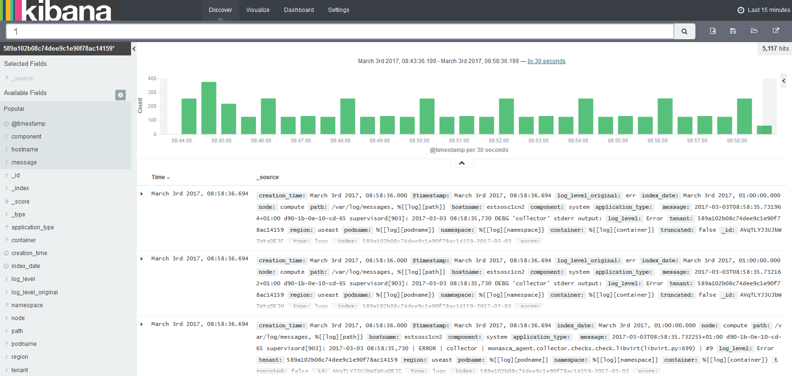
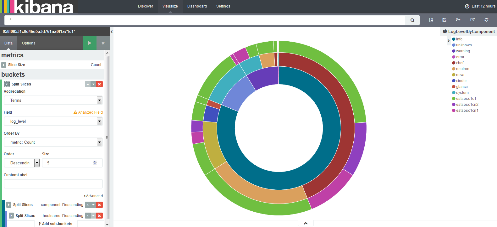
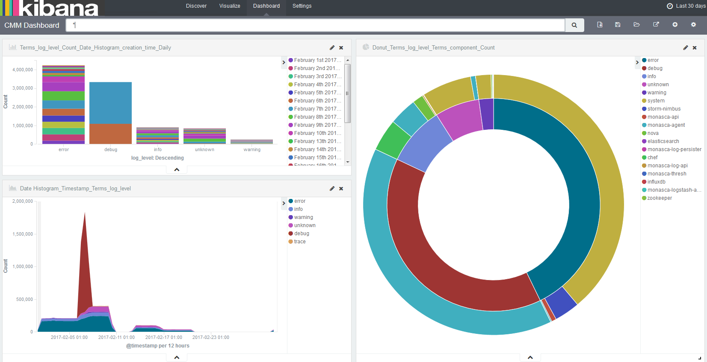

## 6 Log Management

For managing the log data of your services and the virtual and physical servers on which they are
provisioned, CMM integrates with Kibana, an open-source analytics and visualization platform.
CMM uses Kibana as a front-end application to the log data held in the Elasticsearch database.

Kibana allows you to easily understand large data volumes. Based on the data that is stored in
Elasticsearch indices, you can perform advanced data analysis and visualize your log data in a
variety of charts, tables, or maps. Changes to the Elasticsearch indices are displayed in CMM in
real-time.

The log management features of CMM include:

- Features for searching, visualizing, and analyzing the log data.
- Alerting features for monitoring.

In the following sections, you will find information on the log management window where you
search, visualize, and analyze your log data, as well as details on how to use the alerting features.

### Accessing CMM

For accessing CMM and performing log management tasks, the following prerequisites must be
fulfilled:

- You must have access to the OpenStack platform as a user with the `monasca-user` role, or any
  other role that is authorized to use the CMM monitoring functions. Additional roles are optional.
- You must be assigned to the OpenStack project you want to monitor.

Log in to OpenStack Horizon with your user name and password. The functions you can use in
OpenStack Horizon depend on your access permissions.

The CMM functionality is available on the **Monitoring** tab. It provides access to the log data
of all projects to which you are assigned. Before you start, select the project you want to work
on. The **Log Management** option located at the top part of the **Overview** page displays the log
management window where you can work on the log data of the selected project.

## 6.1 Working with the Log Management Window

Index patterns determine which data from the underlying Elasticsearch database can be viewed
and analyzed in CMM's log management window. Index patterns are used to identify the
Elasticsearch indices to run search and analytics against.

CMM ships with a preconfigured index pattern which allows you to instantly view and analyze
your log data when accessing the log management window for the first time. You can configure
additional index patterns to view and analyze different data from different indices. For details, refer
to *Configuring Index Patterns*.

Search queries allow you to search the Elasticsearch indices for data that match your
information requirements. The query results can be graphically represented in visualizations, and
visualizations can be organized in dashboards.

The log management window provides features for:

- Querying log data.
- Visualizing query results.
- Combining visualizations in dashboards.
- Filtering query results.
- Sharing dashboards.

The following sections provide an introduction to queries, visualizations, and dashboards. For
additional details, refer to the _Kibana documentation_.

### Querying Log Data

For querying log data, you use the **Discover** page in the log management window. It is instantly
displayed when you access the window. It shows the most recently collected log data:

The **Discover** page allows you to access the log data in every index that matches the current
index pattern. In addition to submitting queries, you can view, filter, and analyze the log data that is
returned by your queries.

On the **Discover** page the following elements assist you in analyzing your log data:

- Below the main navigation bar at the top of the window, there is a **search box** for querying the
  log data. By submitting a query, you search all indices that match the current index pattern. The
  name of the current index pattern is displayed directly below the search box on the left side.
  You can select a different index pattern, if required. For details on configuring and selecting
  index patterns, refer to _Configuring Index Patterns_.
  
  For entering strings in the search box, use the Lucene query syntax. Kibana also supports the
  Elasticsearch Query DSL. For details, refer to the _Elasticsearch Reference documentation_.

- Use the **clock icon** at the top right of the log management window to define a time range
  for filtering the log data. By default, CMM displays the log data collected during the last 15
  minutes. You can deviate from this default. Multiple options are provided for defining relative or
  absolute time ranges. The time range you define is instantly applied to all log data.

- In the bottom part of the **Discover** page, you can view the **log data** returned by your
  search queries. Depending on whether you have filtered the data by index fields, the log data is
  either restricted to these fields or entire records are displayed.

- Above the histogram of log count, you see the **Selected fields** from the indices that match the 
  current index pattern. You can select individual fields to modify which log data is displayed below.
  
  Select a field from the **Available Fields** section for this purpose and use **add**. To remove a
  field, select it in the **Selected Fields** section and use **remove**.
  
  When selecting a field from the field list, the most common values for the field are shown. You can 
  also set field values as filter, or you can exclude log data with specific field values.

- If a time field is configured for the current index pattern, the distribution of log entries over time
  is displayed in a **histogram** above the display of log data.
  
  By default, the histogram shows the number of logs entries versus time, matched by the
  underlying query and time filter. You can click the bars in the histogram to narrow down the
  time filter.

Queries can be saved and re-used. They can also be shared with other users. For this purpose,
use the options located to the right of the search box along the top of the log management
window:

- To save a query, use **Save Search**. Saving a query means saving both the query syntax and
  the current index pattern.

- To load a query, use **Load Saved Search**. A saved query can be loaded and used by any
  OpenStack or Monitoring Service operator.

- To share a query with other users, use **Share Search**. The option displays a direct link to the
  query that you can forward. As a prerequisite for using a direct link, a user must have CMM
  access.

### Visualizing Query Results

CMM supports you in building graphical representations of your query results. You can choose
from different visualization types, for example pie charts, data tables, line charts, or vertical bar
charts. For visualizing your results, you use the **Visualize** page in the log management window:

To create a visualization, use **New Visualization** located to the right of the search box along the
top of the window. You have to select a visualization type and the query to be used. You can either
create a new query or load a query you have already saved.

Based on the visualization type and the query, you can proceed with designing the graphical
representation in a visualization editor. Multiple design options and a preview function are
provided for creating, modifying, and viewing the graphical representation.

You can save and re-use visualizations. You can also share them with other users. For
this purpose, use the options located to the right of the search box along the top of the log
management window:

- To save a visualization, use **Save Visualization**.
- To load a visualization, use **Load Saved Visualization**. A saved visualization can be loaded
  and used by any OpenStack or Monitoring Service operator.
- To share a visualization with other users, use **Share Visualization**. The option displays an
  HTML snippet that can be used to embed the visualization in a Web page. It also displays a
  direct link to the visualization that you can forward. As a prerequisite for using an embedded
  visualization or a direct link, a user must have CMM access.

### Combining Visualizations in Dashboards

For correlating related information or providing an overview, you can combine visualizations in
dashboards. Use the **Dashboard** page in the log management window for this purpose:

To create a dashboard from scratch, you use **New Dashboard** located to the right of the search
box along the top of the window. To add a visualization from a list of existing visualizations, use
**Add Visualization**. You need at least one saved visualization to create a dashboard. In addition to
adding visualizations, you can also place the tabular output of query results on your dashboards.
Switch to the **Searches** tab when adding a visualization, and select a saved query. This adds the
query result to your dashboard.

A visualization or query result is displayed in a container on your dashboard. Various options are
provided for arranging containers:

- Move a container by clicking and dragging its title bar.
- Resize a container by dragging its bottom right corner.
- Remove a container using **Delete** in the top right corner of the container.

Using **Edit** in the top right corner of a container, you can switch to the **Visualize** or **Discover**
page. This allows you to design the graphical representation or edit the query. To view the raw
data behind a visualization, you can click the bar at the bottom of the container. This replaces your
visualization by the underlying raw data. You can export the raw data, if required.

For each dashboard, you can configure a refresh interval to automatically refresh its content
with the latest data. The current interval is displayed in the top right part of the log management
window. Click the interval if you want to change it. You can define the interval in absolute or
relative terms. Use **Auto-Refresh** next to the interval in the top right part of the log management
window to instantly submit the underlying queries and refresh the dashboard content.

By default, dashboards are displayed with a light background. Using **Options** in the top right part
of the log management window, you can switch to a dark color scheme.

### Filtering Query Results

By submitting a query on the data displayed in a dashboard, you can filter out specific sets of data
that you want to aggregate while not changing the logic of the individual visualizations.

Use the search box below the main navigation bar at the top of the log management window for
entering a query on the whole dashboard. If a visualization is already based on a saved query,
both queries apply.

### Sharing Dashboards

Dashboards can be saved and re-used. They can also be shared with other users. For
this purpose, use the options located to the right of the search box along the top of the log
management window:

- To save a dashboard, use **Save Dashboard**. By default, saving a dashboard also saves the
  time filter that is defined at the time of saving. You can disable this default by clearing the
  **Store time with dashboard** option. Disabling the default means that the time filter is set to the
  currently selected time each time the dashboard is loaded.

- To load a dashboard, use **Load Saved Dashboard**. A saved dashboard can be loaded and
  used by any OpenStack or Monitoring Service operator.

- To share a dashboard with other users, use **Share Dashboard**. The option displays an HTML
  snippet that can be used to embed the dashboard in a Web page. It also displays a direct link
  to the dashboard that you can forward. As a prerequisite for using an embedded dashboard or
  a direct link, a user must have CMM access.

## 6.2 Configuring Index Patterns

CMM enables the dynamic mapping of fields. After configuring an index pattern, the indices that
match the pattern are automatically scanned to display the list of index fields. This guarantees that
the fields are correctly visualized in the dashboard.

CMM ships with a preconfigured index pattern that allows you to instantly explore your
Elasticsearch indices when accessing the dashboard for the first time. You can create additional
patterns to view and analyze specific sets of data. One or multiple patterns can be created per
project. When you create additional patterns, you have to set one of them as the default.

To configure an additional index pattern, use Settings > Indices. Click the index pattern that is
displayed in the Index Patterns field on the left, and use the Add New option.

Indices that match the pattern you define must exist in the Elasticsearch database, and they must
contain data. For an index pattern, you specify the following elements:

- **Index contains time-based events**. It is recommended that this option is selected. This
  improves search performance by enabling searches only on those indices that contain data on
  time-based events.

- **Use event times to create index names**. It is recommended that this option is selected. This
  improves search performance by enabling searches only on those indices that contain data in
  the time range you specify.

- **Index pattern interval**. Select Daily as index pattern interval. Daily intervals are supported by
  the Monitoring Service.

- **Index name or pattern**. The pattern allows you to define dynamic index names. Static text
  in a pattern is denoted using brackets. Replace the predefined pattern (`[logstash-]*` or
  `[logstash-]YYYY.MM.DD`) as follows:
  
  Replace `logstash-` by the project ID of the OpenStack project whose log data is to be
  visualized in the dashboard.
  
  Replace `*` or `YYYY.MM.DD` by `YYYY-MM-DD` as naming pattern. This naming pattern is supported
  by the Monitoring Service.
  
  Example: `[557aff4bf007473d84069aca202a1633-]YYYY-MM-DD`

- **Time-field name**. Select `@timestamp` as time-field name. `@timestamp` matches the
  `YYYY-MM-DD` naming pattern.

The default index pattern is automatically loaded when you access the log management window.
It is marked with an asterisk in front of the pattern name in the **Index Patterns** field at the top
left corner of the **Settings** page. Select the pattern you want to set as the default from the **Index
Patterns** field. The content of the log management window is instantly updated.

## 6.3 Monitoring Log Data

CMM provides alerting features for monitoring your log data. Specific log metrics support you
in checking the severity of the entries in your log files. Log metrics are handled like any other
metrics in CMM. They complete the log management features and support you in analyzing and
troubleshooting any issue that you encounter in your log data.

By default, CMM supports the following log metrics:

- `log.warning` to count warnings in your log data.
- `log.error` to count errors in your log data.
- `log.fatal` to count fatal errors in your log data.
- `log.critical` to count critical errors in your log data.

> **Note:** Your installation might deviate from this default. The log levels that can be evaluated have
  been specified during the installation of CMM.

Using the log metrics for monitoring corresponds to using any other metrics:

- Use **Monitoring > Alarm Definitions** to create, edit, and delete alarms for log data.
- Use **Monitoring > Notifications** to create, edit, and delete notifications for alarms.
- Use **Monitoring > Overview** to check whether there are any irregularities in your log data. As
  soon as you have defined an alarm for your log data and metrics data has been received, there
  is status information displayed on the **Overview** page.

For details on using the log metrics, refer to _Monitoring_.
