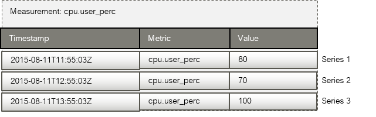

## 4 Operation and Maintenance

Regular operation and maintenance includes:

- Managing projects, users, and roles.
- Starting and stopping agents and services.
- Disabling the monitoring of specific metrics in the configuration of a Metrics Agent.
- Disabling the collection of specific log data in the configuration of a Log Agent.
- Configuring data retention for the InfluxDB database.
- Configuring data retention for the Elasticsearch database.
- Removing metrics data from the InfluxDB database.
- Removing log data from the Elasticsearch database.
- Handling log files of agents and services.
- Backup and recovery of databases and dashboards.


## 4.1 Managing Projects, Users, and Roles

As soon as you have successfully installed CMM, access to the monitoring and log management
functionality is enabled for CMM users from OpenStack Horizon. They must fulfill the prerequisites
described in the following sections.


### CMM Operator and OpenStack Operator

The CMM operator is responsible for monitoring CMM, the OpenStack operator is responsible
for monitoring the OpenStack services and servers. Both must have access to the OpenStack
platform as a user with the `monasca-user` role or any other role that is authorized to use the CMM
functions. Additional roles are optional.

The CMM operator and the OpenStack operator must be assigned to the OpenStack project that
was prepared for CMM, for example, `monasca`.

For details on the project, users, and roles prepared for CMM, refer to Creating Projects, Users,
and Roles.


### Application Operator

An application operator who is responsible for monitoring a VM must have access to the
OpenStack platform as a user with the `monasca-user` role or any other role that is authorized to
use the CMM functions. Additional roles are optional.

The application operator must be assigned to the project for the VM to be monitored.


## 4.2 Starting and Stopping Agents and Services

System operation and maintenance may require that agents and services are manually stopped
and restarted.

The following sections describe:

- Starting and stopping agents and services running in Docker containers on the CMM node.
- Starting and stopping agents installed on an OpenStack node.

### Starting and Stopping the CMM Services and Agents

You can start and stop all containerized services and agents with one command. You can also
start and stop the agents and services individually.

To start all agents and services, proceed as follows:

1. Log in to the CMM node as a user with root privileges.
2. Go to the installation directory.
3. Run `docker-compose` up as follows:

```
docker-compose -f docker-compose-metric.yml -f docker-compose-log.yml up -d
```

> **Note:** Make sure that the OpenStack Keystone service is up when executing the command.
  Use `-d` to start the containers in the background and leave them running when the
  command exits. Refer to the _Docker Compose documentation_ for additional details on
  the `docker-compose up` command.

To start individual CMM agents and services, run `docker-compose` up as follows:

```
docker-compose -f docker-compose-metric.yml -f docker-compose-log.yml up -d <services>
```

Replace `<services>` by the names of the services you want to start. For a list of the service
names, refer to _Installing the Monitoring Service_.

Example for starting Kafka and the Notification Engine:

```
docker-compose -f docker-compose-metric.yml -f docker-compose-log.yml up -d kafka monasca-notification
```

When starting a service that depends on other services, the other services are automatically
started. If you start Kafka, for example, Zookeeper is automatically started when executing the
example command.

> **Note:** For starting the Metrics Agent, it is required to start the collector service
  (`agent-collector`) and the forwarder service (`agent-forwarder`).

To stop all agents and services, proceed as follows:

1. Log in to the CMM node as a user with root privileges.
2. Go to the installation directory.
3. Run docker-compose stop as follows:

```
docker-compose -f docker-compose-metric.yml -f docker-compose-log.yml stop
```

To stop individual CMM agents and services, run docker-compose stop as follows:

```
docker-compose -f docker-compose-metric.yml -f docker-compose-log.yml stop <services>
```

Replace `<services>` by the names of the services you want to stop. For a list of the service
names, refer to _Installing the Monitoring Service_.

Example for stopping Kafka and the Notification Engine:

```
docker-compose -f docker-compose-metric.yml -f docker-compose-log.yml stop kafka monasca-notification
```

> **Note:** For stopping the Metrics Agent, it is required to stop the collector service
  `(agent-collector)` and the forwarder service `(agent-forwarder)`.

To check the status of all agents and services, run docker-compose ps as follows:

```
docker-compose -f docker-compose-metric.yml -f docker-compose-log.yml ps
```

To view the status of an individual container, run docker-compose ps as follows:

```
docker-compose -f docker-compose-metric.yml -f docker-compose-log.yml ps <services>
```

Replace `<services>` by the names of the services you want to stop. For a list of the service
names, refer to _Installing the Monitoring Service_.

Example:

```
docker-compose -f docker-compose-metric.yml -f docker-compose-log.yml ps kafka monasca-notification
```

> **Note:** Run `docker-compose ps` in a separate shell unless you used `docker-compose up -d`
  for installing the Monitoring Service.

### Starting and Stopping Agents on an OpenStack Node

System operation of your OpenStack platform may require that an agent used for monitoring an
OpenStack service is manually stopped and restarted.

To start an agent, proceed as follows:

1. Log in to the OpenStack node on which the agent is installed.
2. To start a Metrics Agent, execute the following command:

```
sudo systemctl start monasca-agent.target
```

To start a Log Agent, execute the following command:

```
sudo systemctl start monasca-log-agent
```

To stop an agent, proceed as follows:

1. Log in to the OpenStack node on which the agent is installed.
2. To stop a Metrics Agent, execute the following command:

```
sudo systemctl stop monasca-agent.target
```

To stop a Log Agent, execute the following command:

```
sudo systemctl stop monasca-log-agent
```


## 4.3 Data Retention and Cleanup

By default, CMM retains the data stored in the Elasticsearch database and the InfluxDB database
for 31 days. Older data is automatically deleted. You can change the default data retention
configuration for the databases, if required. In addition to implementing your data retention
requirements, you should check for the amount and size of the collected metrics and log data at
regular intervals, and delete any unnecessary data to free disk space.

This section describes how to:

- Disable the monitoring of specific metrics in the configuration of a Metrics Agent installed on an
  OpenStack node.
- Disable the collection of specific log data in the configuration of a Log Agent installed on an
  OpenStack node.
- Configure data retention for the InfluxDB database.
- Configure data retention for the Elasticsearch database.
- Remove metrics data from the InfluxDB database.
- Remove log data from the Elasticsearch database.


## 4.3.1 Disabling Metrics for a Metrics Agent on the OpenStack Platform

To disable the monitoring of a specific metrics that is no longer needed in the configuration of a
Metrics Agent, you have to delete the corresponding `.yaml` file.


> **Note:** The following step-by-step description refers to a Metrics Agent that you have installed on
  an OpenStack node. It is assumed that there is no need to disable metrics for the Metrics
  Agent used for monitoring CMM itself.

Proceed as follows:

1. Log in to the OpenStack node on which the agent is installed.
2. To stop the agent, execute the following command:

```
sudo systemctl stop monasca-agent.target
```

3. Change to the directory that stores the metrics. Example:

```
cd /etc/monasca/agent/conf.d
```

4. Delete the `.yaml` file. Example:

```
sudo rm -i process.yaml
```

5. To start the agent again, execute the following command:

```
sudo systemctl start monasca-agent.target
```


## 4.3.2 Disabling Log Data for a Log Agent on the OpenStack Platform

To disable the collection of specific log data that is no longer needed in the configuration of a Log
Agent, you have to delete the corresponding entries in the `agent.conf` configuration file.

> **Note:** The following step-by-step description refers to a Log Agent that you have installed on an
  OpenStack node. It is assumed that there is no need to disable log data for the Log Agent
  used for monitoring CMM itself.

Proceed as follows:

1. Log in to the OpenStack node on which the agent is installed.
2. To stop the agent, execute the following command:

```
sudo systemctl stop monasca-log-agent
```

3. Open the agent configuration file with your favorite editor. Example:

```
sudo vim /opt/monasca/monasca-log-agent/conf/agent.conf
```

4. In the `input` section, delete the file block for the log data you no longer want to monitor.
   If you do not want to monitor log data on Keystone any longer, for example, delete the following
   file block:

```
file {
    ...
    path => "/var/log/containers/keystone/keystone.log"
    ...
  }
```

5. To start the agent again, execute the following command:

```
sudo systemctl start monasca-log-agent
```


## 4.3.3 Configuring Metrics Data Retention

Metrics and alarm history data is stored in the InfluxDB database. InfluxDB features data retention
mechanisms that allow you to define your data retention policies as required by your monitoring
environment. By default, CMM automatically deletes metrics and alarm history data from the
database if it is older than 60 days.

Proceed as follows to change the data retention period which was defined when installing the
Monitoring Service:

1. Log in to the CMM node as a user with root privileges.
2. Go to the installation directory.
3. Stop the `influxdb` service. For this purpose, run `docker-compose stop` as follows:

```
docker-compose -f docker-compose-metric.yml -f docker-compose-log.yml stop influxdb
```

4. Open the `.env` file, and update the data retention parameter as required.
   
   Example for deleting the data after a period of 30 days:

```
# Data retention for InfluxDB database
MON_INFLUXDB_RETENTION=30d
```

5. Start the `influxdb` service. For this purpose, run `docker-compose up` as follows:

```
docker-compose -f docker-compose-metric.yml -f docker-compose-log.yml up -d influxdb
```

As soon as the `influxdb` service is up and running, your new data retention period takes effect.

To change additional data retention settings for your InfluxDB database, you can use the InfluxDB
command line interface, the interactive shell that is provided for the database. Proceed as follows:

1. Log in to the CMM node as a user with root privileges.
2. Connect to InfluxDB as follows:

```
# docker exec -it monascadocker_influxdb_1 /bin/sh
# influx
```

The output of this command is, for example, as follows:

```
Connected to http://localhost:8086 version 1.3.3
InfluxDB shell version: 1.3.3
```

3. Connect to the InfluxDB database of CMM (`mon`):

```
> show databases
name: databases
name
----
mon
_internal

> use mon
Using database mon
```

4. To update your data retention policy, use the `ALTER RETENTION POLICY` command:

```
ALTER RETENTION POLICY <policy_name> ON <db_name> DURATION <duration>
[SHARD DURATION <shard_duration>] [DEFAULT]
```

Replace `<policy_name>` by the name of the retention policy you define. Multiple policies can
be defined, one of them is set as default. `default_mon is the name` of the policy that is initially
installed by CMM.

Replace `<db_name>` by the name of your database.

Replace `<duration>` by the time period after which the data is to be deleted. The minimum
retention period is one hour. You can use the following options for specifying the time period:

- `m` for minutes
- `h` for hours
- `d` for days
- `w` for weeks
- `INF` for infinite retention

Only single units are supported. This means, for example, that you cannot define a time span
of `7230m` as `120h 30m`.

Use `[SHARD DURATION]` to define the time span covered by a shard group. When a retention
policy is enforced for the database, entire shard groups are removed, and not individual data
points. This means that specifying a shorter time range for shard groups than the database
retention period allows you to remove data more efficiently. By default, the shard group
duration is determined by the database retention period as follows:

- A database retention period < 2 days corresponds to a shard group duration of 1 hour.
- A database retention period >= 2 days and <= 6 months corresponds to a shard group
  duration of 1 day.
- A database retention period > 6 months corresponds to a shard group duration of 7 days

To deviate from this default, you can replace `<shard_duration>` by a different time span for
shard groups. You can use the same options as for the database retention period, except for
`INF`.

Use `[DEFAULT]` to set the new retention policy as the default retention policy for your database.
Example for deleting data if it is older than 30 days:

```
ALTER RETENTION POLICY default_mon my_policy ON mon DURATION 30d
DEFAULT
```

For an introduction to the InfluxDB command line interface, refer to the *InfluxDB CLI/Shell
documentation*. For details on data retention, refer to *Retention Policy Management*.


## 4.3.4 Configuring Log Data Retention

Log data is stored in the Elasticsearch database. Elasticsearch stores the data in indices. CMM
uses Elasticsearch Curator for managing data retention of these indices. Elasticsearch Curator
jobs are automatically run by a Cron daemon that executes scheduled commands.
By default, an Elasticsearch index is automatically deleted in CMM if it is older than 60 days. The
delete job is executed every day at midnight (UTC).
Proceed as follows to change the data retention settings that were defined when installing the
Monitoring Service:

1. Log in to the CMM node as a user with root privileges.
2. Go to the installation directory.
3. Stop the `elasticsearch-curator` service. For this purpose, run `docker-compose stop` as
   follows:

```
docker-compose -f docker-compose-metric.yml -f docker-compose-log.yml stop elasticsearch-curator
```

4. Open the `.env` file, and update the data retention parameter as required.
   Example for deleting the data after a period of 30 days:

```
# Data retention for Elasticsearch database
# Delete job is executed every day at 12 a.m. UTC
MON_ELASTICSEARCH_DATA_RETENTION_DAYS=30
```

5. Start the elasticsearch-curator service. For this purpose, run docker-compose up as
   follows:

```
docker-compose -f docker-compose-metric.yml -f docker-compose-log.yml up -d elasticsearch-curator
```

As soon as the elasticsearch-curator service is up and running, your new data retention policy
takes effect.

For details on Elasticsearch Curator, refer to the *Elasticsearch Curator documentation*. Find
details on configuring the Cron daemon, for example, in the *Ubuntu Wiki*.


## 4.3.5 Removing Metrics Data

Metrics data is stored in the Metrics and Alarms InfluxDB Database. InfluxDB features an SQL-like
query language for querying data and performing aggregations on that data.

The Metrics Agent configuration defines the metrics and types of measurement for which data is
stored. For each measurement, a so-called series is written to the InfluxDB database. A series
consists of a timestamp, the metrics, and the value measured.

Example:



Every series can be assigned key tags. In the case of CMM, this is the `_tenant_id tag`. This tag
identifies the OpenStack project for which the metrics data has been collected.

From time to time, you may want to delete outdated or unnecessary metrics data from the Metrics
and Alarms Database, for example, to save space or remove data for metrics you are no longer
interested in. To delete data, you use the InfluxDB command line interface, the interactive shell
that is provided for the InfluxDB database.

Proceed as follows to delete metrics data from the database:

1. Create a backup of the database. For details, refer to _Backup and Recovery_.
2. Log in to the CMM node as a user with root privileges.
3. Connect to InfluxDB as follows:

```
# docker exec -it monascadocker_influxdb_1 /bin/sh
# influx
```

The output of this command is, for example, as follows:

```
Connected to http://localhost:8086 version 1.3.3
InfluxDB shell version: 1.3.3
```

4. Connect to the InfluxDB database of CMM (mon):

```
> show databases
name: databases
name
----
mon
_internal

> use mon
Using database mon
```

5. Check the outdated or unnecessary data to be deleted.

- You can view all measurements for a specific project as follows:

```
SHOW MEASUREMENTS WHERE _tenant_id = '<project ID>'
```

- You can view the series for a specific metrics and project, for example, as follows:

```
SHOW SERIES FROM "cpu.user_perc" WHERE _tenant_id = '<project ID>'
```

6. Delete the desired data.

- When a project is no longer relevant or a specific tenant is no longer used, delete all series
for the project as follows:

```
DROP SERIES WHERE _tenant_id = '<project ID>'
```

Example:

```
DROP SERIES WHERE _tenant_id = '27620d7ee6e948e29172f1d0950bd6f4'
```

- When a metrics is no longer relevant for a project, delete all series for the specific project
  and metrics as follows:

```
DROP SERIES FROM "<metrics>" WHERE _tenant_id = '<project ID>'
```

Example:

```
DROP SERIES FROM "cpu.user_perc" WHERE _tenant_id = '27620d7e'
```


## 4.3.6 Removing Log Data

Log data is stored in the Elasticsearch database. Elasticsearch stores the data in indices. One
index per day is created for every OpenStack project.

By default, the indices are stored in the following directory on the CMM node:

`/usr/share/elasticsearch/data/<cluster-name>/nodes/<node-name>`

Example:

`/usr/share/elasticsearch/data/elasticsearch/nodes/0`

If you want to delete outdated or unnecessary log data from the Elasticsearch database, proceed
as follows:

1. Create a backup of the Elasticsearch database. For details, refer to _Backup and Recovery_ on.
2. Log in to the CMM node as a user with root privileges.
3. To execute curl commands in the elasticsearch container, run docker-compose exec as follows:

```
docker-compose -f docker-compose-metric.yml -f docker-compose-log.yml exec elasticsearch /bin/bash
```

4. Make sure that the data you want to delete exists by executing the following command:

```
curl -XHEAD -i 'http://localhost:<port>/<projectID-date>'
```

For example, if Elasticsearch is listening at port 9200 (default), the ID of the OpenStack project
is abc123, and you want to check the index of 2015, July 1st, the command is as follows:

```
curl -XHEAD -i 'http://localhost:9200/abc123-2015-07-01'
```

If the HTTP response is `200` , the index exists; if the response is `404` , it does not exist.
For listing all indices stored in your Elasticsearch database, you can execute the following
command:

```
curl http://localhost:9200/_cat/indices?v
```

5. Delete an index as follows:

```
curl -XDELETE -i 'http://localhost:<port>/<projectID-date>'
```

Example:

```
curl -XDELETE -i 'http://localhost:9200/abc123-2015-07-01'
```

This command either returns an error, such as `IndexMissingException`, or acknowledges the
successful deletion of the index.

> **Note:** Be aware that the `-XDELETE` command immediately deletes the index file!

Both, for `-XHEAD` and `-XDELETE`, you can use wildcards for processing several indices. For
example, you can delete all indices of a specific project for the whole month of July, 2015:

```
curl -XDELETE -i 'http://localhost:9200/abc123-2015-07-*'
```

> **Note:** Take extreme care when using wildcards for the deletion of indices. You could delete all
existing indices with one single command!


## 4.4 Log File Handling

In case of trouble with the CMM services and the docker containers in which they are deployed,
you can study the log files to find the reason. The log files are also useful if you need to contact
your support organization.

For managing the logs of CMM, the installation automatically deploys a Log Agent on the CMM
node. This allows you to instantly use the log management functions for self-monitoring. You
can use Kibana as a front-end application to the log data collected from the CMM services and
containers. For details, refer to *Log Management*.

You can also use `docker-compose logs` to manually check the log files of the containers
deployed on your CMM node.

To check the log files of individual containers, run `docker-compose logs` as follows:

```
docker-compose -f docker-compose-metric.yml -f docker-compose-log.yml logs <services>
```

Replace `<services>` by the names of the services for which you want to check the log files. For a
list of the service names, refer to *Installing the Monitoring Service*.

Example for checking the Kafka and Kibana log files:

```
docker-compose -f docker-compose-metric.yml -f docker-compose-log.yml logs kafka kibana
```

For more information on `docker-compose logs`, you can execute the following command:

```
docker-compose logs --help
```


### Data Retention for Docker Log Files

By default, Docker log files are not rotated or removed once the containers are started. It is
recommended to configure data retention for the log files so that they do not become too big.

You have the following options:

- You configure data retention for the entire Docker engine, thus for all containers. For details,
  refer to the _Docker documentation_.
- You configure data retention individually for each Docker container by adding a `max-size` entry
  to the Docker Compose YAML files. For details, refer to the _Docker Compose documentation_.


## 4.5 Backup and Recovery

Typical tasks of the Monitoring Service operator are to make regular backups, particularly of the
data created during operation.

At regular intervals, you should make a backup of all:

- Databases.
- Monitoring and log dashboards you have created and saved.

CMM does not offer integrated backup and recovery mechanisms. Instead, you use the
mechanisms and procedures of the individual components.


## 4.5.1 Databases

You need to create regular backups of the following databases on the host where the Monitoring
Service is installed:

- Elasticsearch database
- InfluxDB database
- MySQL database

> **Note:** It is recommended that backup and restore operations for databases are carried out by
  experienced operators only.


### Elasticsearch Database

For backing up and restoring your Elasticsearch database, you can use the Snapshot and Restore
module of Elasticsearch. You have to create a snapshot repository, before creating a regular
backup of your database.

To create a snapshot repository, proceed as follows:

1. Log in to the CMM node as a user with root privileges.
2. To execute `curl` commands in the elasticsearch container, run `docker-compose exec` as
   follows:

```
docker-compose -f docker-compose-metric.yml -f docker-compose-log.yml exec elasticsearch /bin/bash
```

3. Create the snapshot repository. Example:

```
curl -XPUT http://localhost:9200/_snapshot/my_backup -d '{
  "type": "fs",
  "settings": {
    "location": "/elasticsearch_backup/my_backup",
    "compress": true
  }
}'
```

The example registers a shared file system repository (with `"type": "fs"`) that uses the
`/elasticsearch_backup` directory for storing snapshots. The parent directory for storing
snapshots was configured during the installation of the Monitoring Service (`MON_BACKUP_DIR`
parameter in `.env` file). It must have been manually mounted before creating the snapshot.
`compress` is turned on to compress the metadata files.

4. Check whether the repository was created successfully. Example:

```
curl -XGET http://localhost:9200/_snapshot/my_backup
```

Example response for a successfully created repository:

```
{
  "my_backup": {
    "type": "fs",
    "settings": {
      "compress": "true",
      "location": "/elasticsearch_backup/my_backup"
    }
  }
}
```

5. Exit the elasticsearch container:

```
exit
```

As soon as you have successfully created the repository, you can create regular backups of the
database. To create a backup, proceed as follows:

1. Log in to the CMM node as a user with root privileges.
2. Stop all CMM agents and services:

```
docker-compose -f docker-compose-metric.yml -f docker-compose-log.yml stop
```

3. Start the elasticsearch service:

```
docker-compose -f docker-compose-metric.yml -f docker-compose-log.yml up -d elasticsearch
```

4. To execute curl commands in the elasticsearch container, run docker-compose exec as follows:

```
docker-compose -f docker-compose-metric.yml -f docker-compose-log.yml exec elasticsearch /bin/bash
```

5. Create a snapshot of your database that contains all indices. A repository can contain
   multiple snapshots of the same database. The name of a snapshot must be unique within the
   snapshots created for your database. Example:

```
curl -XPUT http://localhost:9200/_snapshot/my_backup/snapshot_1? wait_for_completion=true
```

The example creates a snapshot named `snapshot_1` for all indices in the `my_backup`
repository.

6. Exit the `elasticsearch` container:

```
exit
```

7. Stop the `elasticsearch` service:

```
docker-compose -f docker-compose-metric.yml -f docker-compose-log.yml stop elasticsearch
```
8. Start all CMM agents and services:

```
docker-compose -f docker-compose-metric.yml -f docker-compose-log.yml up -d
```

To restore a database instance, proceed as follows:

1. Log in to the CMM node as a user with root privileges.
2. Make sure that the backup of your database is available in the directory that was mounted
   before creating the snapshot.
3. Stop all CMM agents and services:

```
docker-compose -f docker-compose-metric.yml -f docker-compose-log.yml stop
```

4. Start the `elasticsearch` service:

```
docker-compose -f docker-compose-metric.yml -f docker-compose-log.yml up -d elasticsearch
```

5. To execute `curl` commands in the `elasticsearch` container, run `docker-compose` exec as
   follows:

```
docker-compose -f docker-compose-metric.yml -f docker-compose-log.yml exec elasticsearch /bin/bash
```

6. Close all indices of your database. Example:

```
curl -XPOST http://localhost:9200/_all/_close
```

If the call is successful, Elasticsearch returns `{"acknowledged":true}`.

7. Restore all indices from the snapshot you have created. Example:

```
curl -XPOST http://localhost:9200/_snapshot/my_backup/snapshot_1/_restore
```

The example restores all indices from `snapshot_1` that is stored in the `my_backup` repository.
If the call is successful, Elasticsearch returns `{"accepted":true}`.

8. Exit the elasticsearch container:

```
exit
```

9. Stop the `elasticsearch` service:

```
docker-compose -f docker-compose-metric.yml -f docker-compose-log.yml stop elasticsearch
```

10.Start all CMM agents and services:

```
docker-compose -f docker-compose-metric.yml -f docker-compose-log.yml up -d
```

For additional information on backing up and restoring an Elasticsearch database, refer to the
_Elasticsearch documentation_.

### InfluxDB Database

To create a backup of the database, proceed as follows:

1. Log in to the CMM node as a user with root privileges.
2. Stop all CMM agents and services:

```
docker-compose -f docker-compose-metric.yml -f docker-compose-log.yml stop
```

3. Start the `influxdb` service:

```
docker-compose -f docker-compose-metric.yml -f docker-compose-log.yml up -d influxdb
```

4. For backing up the InfluxDB database, you need to know the ID of the container in which the
   database is running:

```
docker ps | grep influxd
```

Example output with `c6be4ebebefe` as container ID:

```
c6be4ebebefe influxdb:1.3.4-alpine "/entrypoint.sh infl..."
19 hours ago Up 6 seconds 8086/tcp monascadocker_influxdb_1
```

5. Back up the database:

```
docker exec <container_id> influxd backup -database <db_name> "/influxdb_backup/<name>.backup"
```

Replace `<container_id>` by the ID of the container in which the database is running,
`<db_name>` by the name of the database and `<name>` by the name of the backup file to be
created.

The following example creates a backup of the `mon` database, running in container
`07e9007e0be8`, in `mon.backup`:

```
docker exec c6be4ebebefe influxd backup -database mon "/influxdb_backup/mon.backup"
```

6. Stop the `influxdb` service:

```
docker-compose -f docker-compose-metric.yml -f docker-compose-log.yml stop influxdb
```

7. Start all CMM agents and services:

```
docker-compose -f docker-compose-metric.yml -f docker-compose-log.yml up -d
```

To restore the database, proceed as follows:

1. Log in to the CMM node as a user with root privileges.
2. Stop all CMM agents and services:

```
docker-compose -f docker-compose-metric.yml -f docker-compose-log.yml stop
```

3. Make sure that the backup file is available in the `<path_to_backup_dir>/influxdb_backup`
   directory. `<path_to_backup_dir>` is the default volume you configured for backing up the
   databases during the installation of the Monitoring Service (`MON_BACKUP_DIR` parameter in
   `.env` file).
4. With SELinux enabled, make sure that `svirt_sandbox_file_t` is set as security context type
   for the backup file.
   
   Example with `MON_BACKUP_DIR` set to `/mount/backup`:

```
# ls -lZ /mount/backup/influxdb_backup/
drwx------. root root system_u:object_r:svirt_sandbox_file_t:s0:c335,c530 mon.backup
```

5. Restore the database to an ephemeral container:

```
# docker run --rm --entrypoint /bin/ash
-v <path_to_data_dir>/influxdb:/var/lib/influxdb:Z
-v <path_to_backup_dir>/influxdb_backup:/influxdb_backup:Z
influxdb:1.3.4-alpine
-c "influxd restore -metadir /var/lib/influxdb/meta
-datadir /var/lib/influxdb/data
-database <db_name> /influxdb_backup/<name>.backup"
```

Replace the variables as follows:

- `<path_to_data_dir>` by the default volume you configured for the data directories during
  the installation of the Monitoring Service (`MON_DOCKER_VOL_ROOT` parameter in `.env` file).
- `<path_to_backup_dir>` by the default volume you configured for backing up the
  databases.
- `<db_name>` by the name of the database.
- `<name>` by the name of the backup file to be restored.

With SELinux enabled, `:Z` must be specified for the `-v` option.

6. Start all CMM agents and services:

```
docker-compose -f docker-compose-metric.yml -f docker-compose-log.yml up -d
```

### MySQL Database

For backing up and restoring your MySQL database, you can use the `mysqldump` utility program.
`mysqldump` performs a logical backup that produces a set of SQL statements. These statements
can later be executed to restore the database.

To back up your MySQL database, proceed as follows:

1. Log in to the CMM node as a user with root privileges.
2. Stop all CMM agents and services:

```
docker-compose -f docker-compose-metric.yml -f docker-compose-log.yml stop
```

3. Start the `mysql` service:

```
docker-compose -f docker-compose-metric.yml -f docker-compose-log.yml up -d mysql
```

4. Backup the database. To create the backup from your local machine, execute the following
   command:

```
docker exec <container_id> mysqldump -u root --password=secretmysql <db_name> > <backup_dir>/<name>
```

Replace `<container_id>` by the ID of the container in which the database is running,
`<db_name>` by the name of the database, `<backup_dir>` by the directory you have mounted for
storing the backup file, and `<name>` by the name of the backup file to be created.
For the `--password` parameter, check the `MYSQL_ROOT_PASSWORD` specified in the
`docker-compose-metric.yml` file.

The following example creates a backup of the `mon` database, running in container
`07e9007e0be8`, in `/backup/mon.sql`:

```
docker exec 07e9007e0be8 mysqldump -u root --password=secretmysql mon > /backup/mon.sql
```

5. Check whether the backup was created successfully.
6. Stop the `mysql` service:

```
docker-compose -f docker-compose-metric.yml -f docker-compose-log.yml stop mysql
```

7. Start all CMM agents and services:

```
docker-compose -f docker-compose-metric.yml -f docker-compose-log.yml up -d
```

To restore your MySQL database, proceed as follows:

1. Log in to the CMM node as a user with root privileges.
2. Stop all CMM agents and services:

```
docker-compose -f docker-compose-metric.yml -f docker-compose-log.yml stop
```

3. Start the mysql service:

```
docker-compose -f docker-compose-metric.yml -f docker-compose-log.yml up -d mysql
```

4. Restore the database:

```
cat <backup_dir>/<name> | docker exec -i <container_id> mysql -u root --password=secretmysql <db_name>
```

Replace `<backup_dir>` by the directory where the backup file is stored, `<name>` by the name
of the file, `<container_id>` by the ID of the container in which the database is running, and
`<db_name>` by the name of the database.

For the `--password` parameter, check the `MYSQL_ROOT_PASSWORD` specified in the
`docker-compose-metric.yml` file.

The following example restores the mon database, running in container `07e9007e0be8`, from `/
backup/mon.sql`:

```
cat /backup/mon.sql | docker exec -i 07e9007e0be8 mysql -u root --password=secretmysql mon
```

5. Stop the `mysql` service:

```
docker-compose -f docker-compose-metric.yml -f docker-compose-log.yml stop mysql
```

6. Start all CMM agents and services:

```
docker-compose -f docker-compose-metric.yml -f docker-compose-log.yml up -d
```

For additional information on backing up and restoring a MySQL database with `mysqldump`, refer
to the *MySQL documentation*.


## 4.5.2 Dashboards

Kibana can persist customized dashboard designs to the Elasticsearch database, and allows you
to recall them. For details on saving, loading, and sharing dashboards for log management, refer
to the *Kibana documentation*.

As a Grafana administrator, you are allowed to export dashboards to a JSON file, and to re-import
them when necessary. Use the administrator credentials defined in the `.env` file for the installation
of the Monitoring Service to directly access Grafana and export dashboards. For backing up
and restoring the exported dashboards, you can then use the standard mechanisms of your file
system. For details on exporting m
